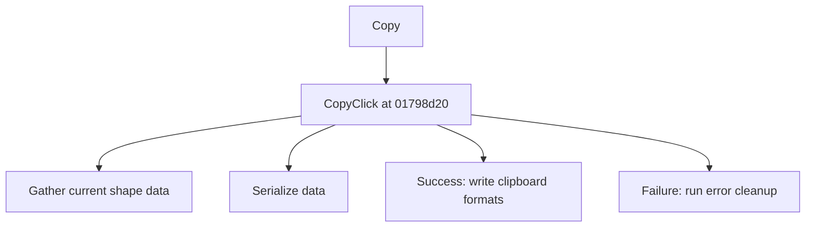

# Copy

> Analysis status: Source reviewed for TIARA-diz.6.7.1603.

## Control

| Property | Recovered value |
| --- | --- |
| Form | ShapeEdit |
| Component path | ShapeEdit.TopToolBar.GeneralTools.sbCopy |
| Control class | TSpeedButton |
| Caption | Copy |
| Hint | Copy |
| Handler name | CopyClick |
| Handler address | 01798d20 |
| Graph node | `resource:dfm:ShapeEdit/ShapeEdit.TopToolBar.GeneralTools.sbCopy` |
| Handler node | `function:01798d20` |

## What happens when clicked

Builds a serialized shape-data object from the editor. When serialization succeeds, it publishes the bytes in the application clipboard format and in a second clipboard format. When serialization fails, it runs the recovered cleanup or error paths and does not replace the clipboard data.

This control shares the recovered handler with `ShapeEdit.MainMenu.Edit.Copy`. This article keeps the resource evidence for this control separate.

## Click flow

## Evidence

- Handler source: [0000000001798D20__FUN_01798d20.c](../../../DecompiledSources/Tina16/functions/0000000001798D20__FUN_01798d20.c)
- Extracted glyph 1: [0418_ShapeEdit_ShapeEdit_TopToolBar_GeneralTools_sbCopy_Glyph_Data.png](../../../glyph/0418_ShapeEdit_ShapeEdit_TopToolBar_GeneralTools_sbCopy_Glyph_Data.png)
- Recovered path: The handler calls 01797160 to gather drawing data, tests the 00c3cb20 serialization result, and calls the clipboard helpers only on the successful branch.
- Resource context: The recovered TSpeedButton resource uses caption `Copy` and hint `Copy`. The extracted glyph was visually inspected. It agrees with the recovered resource intent, but the source path remains the behavior proof.

## Analysis limits

- The recovered source does not expose the user-facing text, if any, from the failure helpers.
- The caption, hint, and glyph support control identity only. They do not replace the recovered handler and callee evidence.

