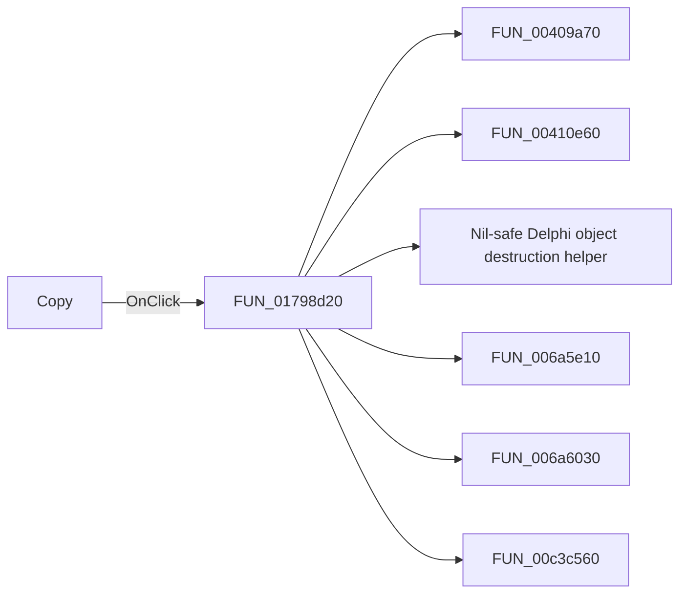

# Copy

> Analysis status: Pending individual source review.

## Control

| Property | Recovered value |
| --- | --- |
| Form | ShapeEdit |
| Component path | ShapeEdit.TopToolBar.GeneralTools.sbCopy |
| Control class | TSpeedButton |
| Caption | Not present in the recovered resource. |
| Hint | Copy |
| Text | Not present in the recovered resource. |
| Handler name | CopyClick |
| Handler address | 01798d20 |
| Graph node | `resource:dfm:ShapeEdit/ShapeEdit.TopToolBar.GeneralTools.sbCopy` |
| Handler node | `function:01798d20` |
| Graph layer | UI |

## What happens when clicked

Pending individual analysis. An agent must read the recovered handler source and its relevant callees before it replaces this text.

## Click flow

## Handler evidence

- Source: [DecompiledSources/Tina16/functions/0000000001798D20__FUN_01798d20.c](../../../DecompiledSources/Tina16/functions/0000000001798D20__FUN_01798d20.c)
- Recovered role: Not present in the recovered resource.
- Current graph summary: Handles 2 Delphi UI events: ShapeEdit.TopToolBar.GeneralTools.sbCopy.OnClick, ShapeEdit.MainMenu.Edit.Copy.OnClick.
- Current graph behavior: Not present in the recovered resource.
- Current graph evidence: Not present in the recovered resource.
- Complexity: complex
- Distinct outgoing calls: 11

## Direct calls

- `function:00409a70` — FUN_00409a70
- `function:00410e60` — FUN_00410e60
- `function:00410f20` — Nil-safe Delphi object destruction helper
- `function:006a5e10` — FUN_006a5e10
- `function:006a6030` — FUN_006a6030
- `function:00c3c560` — FUN_00c3c560
- `function:00c3cb20` — FUN_00c3cb20
- `function:01797160` — FUN_01797160
- `function:01798f50` — FUN_01798f50
- `function:01798fc0` — FUN_01798fc0
- `function:01d30b30` — FUN_01d30b30

## Resource evidence

- Kind: Not present in the recovered resource.
- Modal result: Not present in the recovered resource.
- Checked state: Not present in the recovered resource.
- List items: Not present in the recovered resource.
- Image reference: Not present in the recovered resource.
- Extracted glyph: [`0418_ShapeEdit_ShapeEdit_TopToolBar_GeneralTools_sbCopy_Glyph_Data.png`](../../../glyph/0418_ShapeEdit_ShapeEdit_TopToolBar_GeneralTools_sbCopy_Glyph_Data.png)

## Nearby label candidates

Nearby labels are layout candidates only. They are not proof of behavior.

- No same-parent label candidate is available.

## Analysis limits

- Do not infer behavior from the control class, caption, hint, glyph, or nearby label alone.
- Do not replace the pending status until the handler source and relevant call path provide enough evidence.
