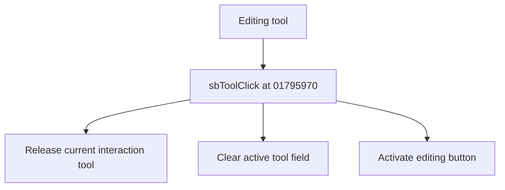

# Editing tool

> Analysis status: Source reviewed for TIARA-diz.6.7.1591.

## Control

| Property | Recovered value |
| --- | --- |
| Form | ShapeEdit |
| Component path | ShapeEdit.TopToolBar.EditorTools.sbEdit |
| Control class | TSpeedButton |
| Caption | Editing tool |
| Hint | Editing tool |
| Handler name | sbToolClick |
| Handler address | 01795970 |
| Graph node | `resource:dfm:ShapeEdit/ShapeEdit.TopToolBar.EditorTools.sbEdit` |
| Handler node | `function:01795970` |

## What happens when clicked

Releases the current active interaction tool, clears its field, and activates the standard editing speed button.

## Click flow

## Evidence

- Handler source: [0000000001795970__FUN_01795970.c](../../../DecompiledSources/Tina16/functions/0000000001795970__FUN_01795970.c)
- Extracted glyph 1: [0405_ShapeEdit_ShapeEdit_TopToolBar_EditorTools_sbEdit_Glyph_Data.png](../../../glyph/0405_ShapeEdit_ShapeEdit_TopToolBar_EditorTools_sbEdit_Glyph_Data.png)
- Recovered path: The handler calls 01794bc0. That helper destroys field +0xd20 when present, stores null, and calls 01794d60 with field +0x6e8.
- Resource context: The recovered TSpeedButton resource uses caption `Editing tool` and hint `Editing tool`. The extracted glyph was visually inspected. It agrees with the recovered resource intent, but the source path remains the behavior proof.

## Analysis limits

- No additional implementation gap was found in the recovered click path.
- The caption, hint, and glyph support control identity only. They do not replace the recovered handler and callee evidence.

