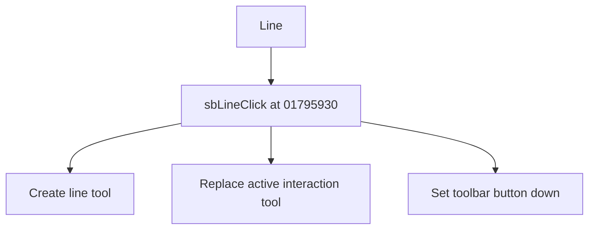

# Line

> Analysis status: Source reviewed for TIARA-diz.6.7.1594.

## Control

| Property | Recovered value |
| --- | --- |
| Form | ShapeEdit |
| Component path | ShapeEdit.TopToolBar.EditorTools.sbLine |
| Control class | TSpeedButton |
| Caption | Line |
| Hint | Line |
| Handler name | sbLineClick |
| Handler address | 01795930 |
| Graph node | `resource:dfm:ShapeEdit/ShapeEdit.TopToolBar.EditorTools.sbLine` |
| Handler node | `function:01795930` |

## What happens when clicked

Creates the recovered line tool object, installs it as the active ShapeEdit interaction tool, and sets the corresponding toolbar button down. A previous active tool is released by the shared installation path.

This control shares the recovered handler with `ShapeEdit.MainMenu.mnDraw.mnuLine`. This article keeps the resource evidence for this control separate.

## Click flow

## Evidence

- Handler source: [0000000001795930__FUN_01795930.c](../../../DecompiledSources/Tina16/functions/0000000001795930__FUN_01795930.c)
- Extracted glyph 1: [0406_ShapeEdit_ShapeEdit_TopToolBar_EditorTools_sbLine_Glyph_Data.png](../../../glyph/0406_ShapeEdit_ShapeEdit_TopToolBar_EditorTools_sbLine_Glyph_Data.png)
- Recovered path: The handler constructs the line tool class, calls 01794b80 to replace field +0xd20, and updates the recovered speed-button state.
- Resource context: The recovered TSpeedButton resource uses caption `Line` and hint `Line`. The extracted glyph was visually inspected. It agrees with the recovered resource intent, but the source path remains the behavior proof.

## Analysis limits

- No additional implementation gap was found in the recovered click path.
- The caption, hint, and glyph support control identity only. They do not replace the recovered handler and callee evidence.

