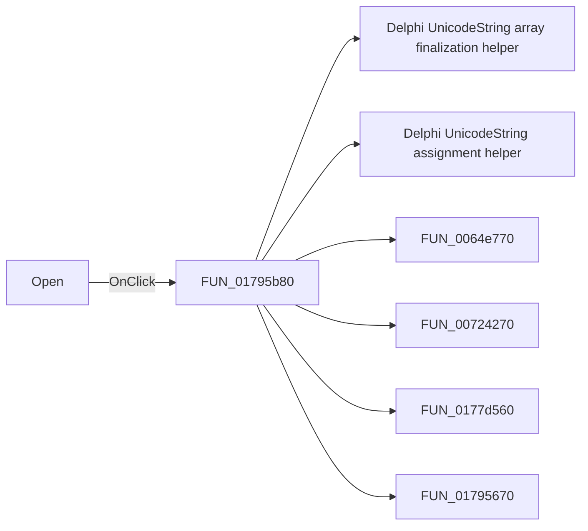

# Open

> Analysis status: Pending individual source review.

## Control

| Property | Recovered value |
| --- | --- |
| Form | ShapeEdit |
| Component path | ShapeEdit.TopToolBar.GeneralTools.sbOpen |
| Control class | TSpeedButton |
| Caption | Not present in the recovered resource. |
| Hint | Open |
| Text | Not present in the recovered resource. |
| Handler name | OpenClick |
| Handler address | 01795b80 |
| Graph node | `resource:dfm:ShapeEdit/ShapeEdit.TopToolBar.GeneralTools.sbOpen` |
| Handler node | `function:01795b80` |
| Graph layer | UI |

## What happens when clicked

Pending individual analysis. An agent must read the recovered handler source and its relevant callees before it replaces this text.

## Click flow

## Handler evidence

- Source: [DecompiledSources/Tina16/functions/0000000001795B80__FUN_01795b80.c](../../../DecompiledSources/Tina16/functions/0000000001795B80__FUN_01795b80.c)
- Recovered role: Not present in the recovered resource.
- Current graph summary: Handles 2 Delphi UI events: ShapeEdit.TopToolBar.GeneralTools.sbOpen.OnClick, ShapeEdit.MainMenu.mnFile.Open.OnClick.
- Current graph behavior: Not present in the recovered resource.
- Current graph evidence: Not present in the recovered resource.
- Complexity: complex
- Distinct outgoing calls: 11

## Direct calls

- `function:00414560` — Delphi UnicodeString array finalization helper
- `function:00414ad0` — Delphi UnicodeString assignment helper
- `function:0064e770` — FUN_0064e770
- `function:00724270` — FUN_00724270
- `function:0177d560` — FUN_0177d560
- `function:01795670` — FUN_01795670
- `function:01795d10` — FUN_01795d10
- `function:017960f0` — FUN_017960f0
- `function:01798270` — FUN_01798270
- `function:01798460` — FUN_01798460
- `function:017989e0` — FUN_017989e0

## Resource evidence

- Kind: Not present in the recovered resource.
- Modal result: Not present in the recovered resource.
- Checked state: Not present in the recovered resource.
- List items: Not present in the recovered resource.
- Image reference: Not present in the recovered resource.
- Extracted glyph: [`0420_ShapeEdit_ShapeEdit_TopToolBar_GeneralTools_sbOpen_Glyph_Data.png`](../../../glyph/0420_ShapeEdit_ShapeEdit_TopToolBar_GeneralTools_sbOpen_Glyph_Data.png)

## Nearby label candidates

Nearby labels are layout candidates only. They are not proof of behavior.

- No same-parent label candidate is available.

## Analysis limits

- Do not infer behavior from the control class, caption, hint, glyph, or nearby label alone.
- Do not replace the pending status until the handler source and relevant call path provide enough evidence.
