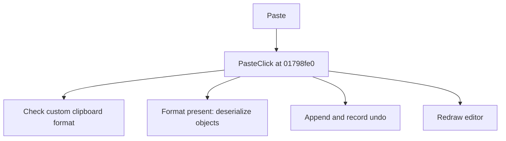

# Paste

> Analysis status: Source reviewed for TIARA-diz.6.7.1606.

## Control

| Property | Recovered value |
| --- | --- |
| Form | ShapeEdit |
| Component path | ShapeEdit.TopToolBar.GeneralTools.sbPaste |
| Control class | TSpeedButton |
| Caption | Paste |
| Hint | Paste |
| Handler name | PasteClick |
| Handler address | 01798fe0 |
| Graph node | `resource:dfm:ShapeEdit/ShapeEdit.TopToolBar.GeneralTools.sbPaste` |
| Handler node | `function:01798fe0` |

## What happens when clicked

Opens the clipboard and checks the application shape format. If the format is absent, it closes the clipboard without changing the document. If data is available, it deserializes the shape data, clears the current interaction, creates pasted objects, appends them, records undo state, marks the document dirty, and redraws. A null clipboard handle takes the recovered error path.

This control shares the recovered handler with `ShapeEdit.MainMenu.Edit.Paste`. This article keeps the resource evidence for this control separate.

## Click flow

## Evidence

- Handler source: [0000000001798FE0__FUN_01798fe0.c](../../../DecompiledSources/Tina16/functions/0000000001798FE0__FUN_01798fe0.c)
- Extracted glyph 1: [0417_ShapeEdit_ShapeEdit_TopToolBar_GeneralTools_sbPaste_Glyph_Data.png](../../../glyph/0417_ShapeEdit_ShapeEdit_TopToolBar_GeneralTools_sbPaste_Glyph_Data.png)
- Recovered path: The handler checks the registered format, reads the clipboard handle into a stream, calls the recovered deserializer and object-instantiation path, appends objects to field +0xd10, creates an undo command, calls 01795670 with 1, and invalidates the editor.
- Resource context: The recovered TSpeedButton resource uses caption `Paste` and hint `Paste`. The extracted glyph was visually inspected. It agrees with the recovered resource intent, but the source path remains the behavior proof.

## Analysis limits

- The user-facing message from the null-handle error helper is not recovered here.
- The caption, hint, and glyph support control identity only. They do not replace the recovered handler and callee evidence.

