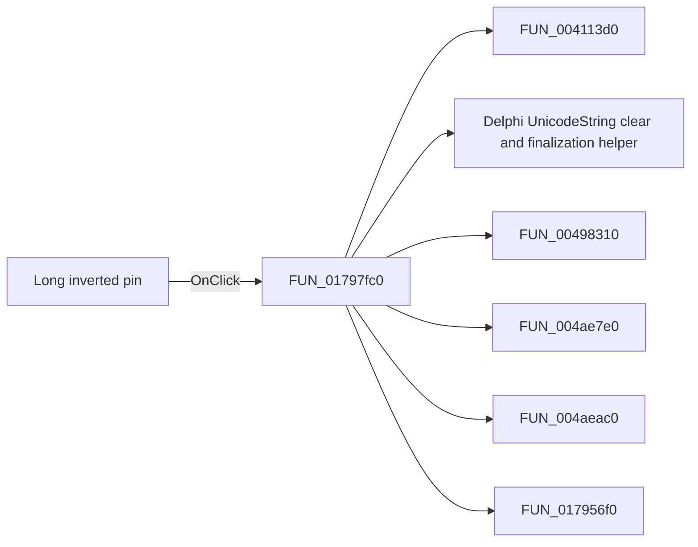

# Long inverted pin

> Analysis status: Pending individual source review.

## Control

| Property | Recovered value |
| --- | --- |
| Form | ShapeEdit |
| Component path | ShapeEdit.PartsPanel.PinPanel.sbPinLD |
| Control class | TSpeedButton |
| Caption | Not present in the recovered resource. |
| Hint | Long inverted pin |
| Text | Not present in the recovered resource. |
| Handler name | sbPinNDClick |
| Handler address | 01797fc0 |
| Graph node | `resource:dfm:ShapeEdit/ShapeEdit.PartsPanel.PinPanel.sbPinLD` |
| Handler node | `function:01797fc0` |
| Graph layer | UI |

## What happens when clicked

Pending individual analysis. An agent must read the recovered handler source and its relevant callees before it replaces this text.

## Click flow

## Handler evidence

- Source: [DecompiledSources/Tina16/functions/0000000001797FC0__FUN_01797fc0.c](../../../DecompiledSources/Tina16/functions/0000000001797FC0__FUN_01797fc0.c)
- Recovered role: Not present in the recovered resource.
- Current graph summary: Handles 10 Delphi UI events: ShapeEdit.PartsPanel.PinPanel.sbPinX.OnClick, ShapeEdit.PartsPanel.PinPanel.sbPinMini.OnClick, ShapeEdit.PartsPanel.PinPanel.sbPinLN.OnClick.
- Current graph behavior: Not present in the recovered resource.
- Current graph evidence: Not present in the recovered resource.
- Complexity: complex
- Distinct outgoing calls: 10

## Direct calls

- `function:004113d0` — FUN_004113d0
- `function:00414480` — Delphi UnicodeString clear and finalization helper
- `function:00498310` — FUN_00498310
- `function:004ae7e0` — FUN_004ae7e0
- `function:004aeac0` — FUN_004aeac0
- `function:017956f0` — FUN_017956f0
- `function:01795890` — FUN_01795890
- `function:01797e80` — FUN_01797e80
- `function:017afd00` — FUN_017afd00
- `function:017b02a0` — FUN_017b02a0

## Resource evidence

- Kind: Not present in the recovered resource.
- Modal result: Not present in the recovered resource.
- Checked state: Not present in the recovered resource.
- List items: Not present in the recovered resource.
- Image reference: Not present in the recovered resource.
- Extracted glyph: [`0428_ShapeEdit_ShapeEdit_PartsPanel_PinPanel_sbPinLD_Glyph_Data.png`](../../../glyph/0428_ShapeEdit_ShapeEdit_PartsPanel_PinPanel_sbPinLD_Glyph_Data.png)

## Nearby label candidates

Nearby labels are layout candidates only. They are not proof of behavior.

- No same-parent label candidate is available.

## Analysis limits

- Do not infer behavior from the control class, caption, hint, glyph, or nearby label alone.
- Do not replace the pending status until the handler source and relevant call path provide enough evidence.
