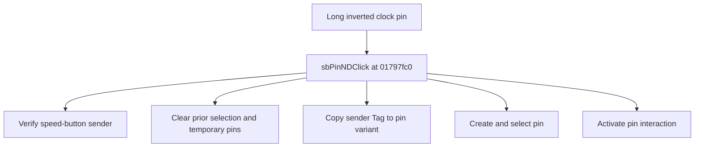

# Long inverted clock pin

> Analysis status: Source reviewed for TIARA-diz.6.7.1575.

## Control

| Property | Recovered value |
| --- | --- |
| Form | ShapeEdit |
| Component path | ShapeEdit.PartsPanel.PinPanel.sbPinLDC |
| Control class | TSpeedButton |
| Caption | Long inverted clock pin |
| Hint | Long inverted clock pin |
| Handler name | sbPinNDClick |
| Handler address | 01797fc0 |
| Graph node | `resource:dfm:ShapeEdit/ShapeEdit.PartsPanel.PinPanel.sbPinLDC` |
| Handler node | `function:01797fc0` |

## What happens when clicked

Clears current selection state and temporary pin objects, copies the clicked speed button's Delphi Tag value into the new pin variant field, creates and selects a pin object, and installs the pin interaction state. The specific pin style therefore depends on the sender control.

This control shares the recovered handler with `ShapeEdit.PartsPanel.PinPanel.sbPinLC`, `ShapeEdit.PartsPanel.PinPanel.sbPinLD`, `ShapeEdit.PartsPanel.PinPanel.sbPinLN`, `ShapeEdit.PartsPanel.PinPanel.sbPinMini`, `ShapeEdit.PartsPanel.PinPanel.sbPinNC`, `ShapeEdit.PartsPanel.PinPanel.sbPinND`, `ShapeEdit.PartsPanel.PinPanel.sbPinNDC`, `ShapeEdit.PartsPanel.PinPanel.sbPinNN`, `ShapeEdit.PartsPanel.PinPanel.sbPinX`. This article keeps the resource evidence for this control separate.

## Click flow

## Evidence

- Handler source: [0000000001797FC0__FUN_01797fc0.c](../../../DecompiledSources/Tina16/functions/0000000001797FC0__FUN_01797fc0.c)
- Extracted glyph 1: [0431_ShapeEdit_ShapeEdit_PartsPanel_PinPanel_sbPinLDC_Glyph_Data.png](../../../glyph/0431_ShapeEdit_ShapeEdit_PartsPanel_PinPanel_sbPinLDC_Glyph_Data.png)
- Recovered path: The shared handler verifies TSpeedButton Sender, calls 017956f0, clears field +0xd28, reads Sender offset +0x18 (TComponent.Tag), writes that value into the pin data, constructs a pin through 017b02a0, selects it, and activates the interaction path.
- Resource context: The recovered TSpeedButton resource uses caption `Long inverted clock pin` and hint `Long inverted clock pin`. The extracted glyph was visually inspected. It agrees with the recovered resource intent, but the source path remains the behavior proof.

## Analysis limits

- The extracted DFM evidence omits each Tag numeric value. The hint and inspected glyph identify the intended variant, but the exact enum number remains unknown.
- The caption, hint, and glyph support control identity only. They do not replace the recovered handler and callee evidence.

