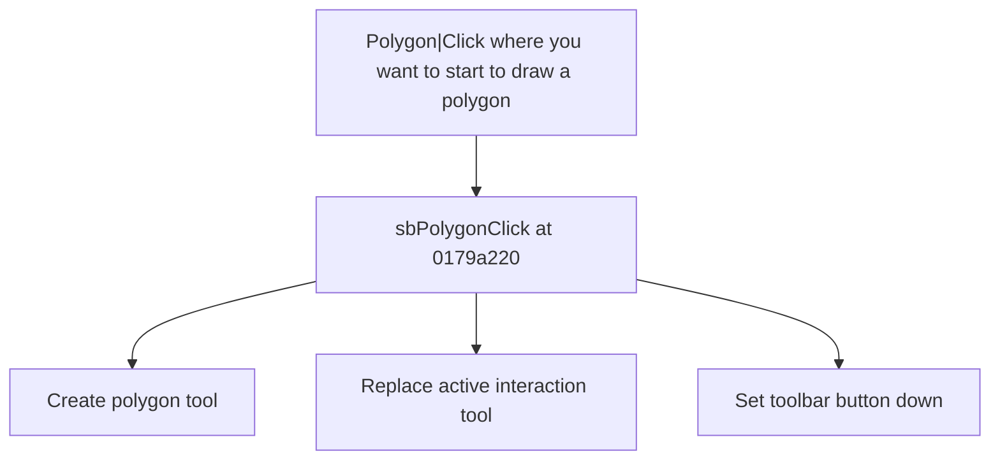

# Polygon|Click where you want to start to draw a polygon

> Analysis status: Source reviewed for TIARA-diz.6.7.1595.

## Control

| Property | Recovered value |
| --- | --- |
| Form | ShapeEdit |
| Component path | ShapeEdit.TopToolBar.EditorTools.sbPolygon |
| Control class | TSpeedButton |
| Caption | Polygon\|Click where you want to start to draw a polygon |
| Hint | Polygon\ |
| Handler name | sbPolygonClick |
| Handler address | 0179a220 |
| Graph node | `resource:dfm:ShapeEdit/ShapeEdit.TopToolBar.EditorTools.sbPolygon` |
| Handler node | `function:0179a220` |

## What happens when clicked

Creates the recovered polygon tool object, installs it as the active ShapeEdit interaction tool, and sets the corresponding toolbar button down. A previous active tool is released by the shared installation path.

This control shares the recovered handler with `ShapeEdit.MainMenu.mnDraw.mnuPolygon`. This article keeps the resource evidence for this control separate.

## Click flow

## Evidence

- Handler source: [000000000179A220__FUN_0179a220.c](../../../DecompiledSources/Tina16/functions/000000000179A220__FUN_0179a220.c)
- Extracted glyph 1: [0410_ShapeEdit_ShapeEdit_TopToolBar_EditorTools_sbPolygon_Glyph_Data.png](../../../glyph/0410_ShapeEdit_ShapeEdit_TopToolBar_EditorTools_sbPolygon_Glyph_Data.png)
- Recovered path: The handler constructs the polygon tool class, calls 01794b80 to replace field +0xd20, and updates the recovered speed-button state.
- Resource context: The recovered TSpeedButton resource uses caption `Polygon\|Click where you want to start to draw a polygon` and hint `Polygon\`. The extracted glyph was visually inspected. It agrees with the recovered resource intent, but the source path remains the behavior proof.

## Analysis limits

- No additional implementation gap was found in the recovered click path.
- The caption, hint, and glyph support control identity only. They do not replace the recovered handler and callee evidence.

