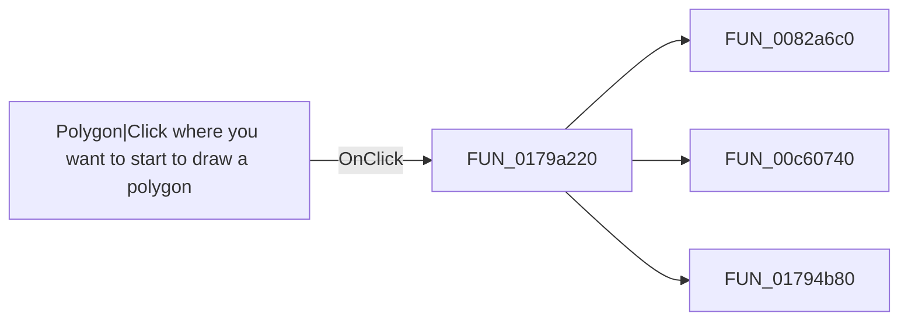

# Polygon|Click where you want to start to draw a polygon

> Analysis status: Pending individual source review.

## Control

| Property | Recovered value |
| --- | --- |
| Form | ShapeEdit |
| Component path | ShapeEdit.TopToolBar.EditorTools.sbPolygon |
| Control class | TSpeedButton |
| Caption | Not present in the recovered resource. |
| Hint | Polygon\|Click where you want to start to draw a polygon |
| Text | Not present in the recovered resource. |
| Handler name | sbPolygonClick |
| Handler address | 0179a220 |
| Graph node | `resource:dfm:ShapeEdit/ShapeEdit.TopToolBar.EditorTools.sbPolygon` |
| Handler node | `function:0179a220` |
| Graph layer | UI |

## What happens when clicked

Pending individual analysis. An agent must read the recovered handler source and its relevant callees before it replaces this text.

## Click flow

## Handler evidence

- Source: [DecompiledSources/Tina16/functions/000000000179A220__FUN_0179a220.c](../../../DecompiledSources/Tina16/functions/000000000179A220__FUN_0179a220.c)
- Recovered role: Not present in the recovered resource.
- Current graph summary: Handles 2 Delphi UI events: ShapeEdit.TopToolBar.EditorTools.sbPolygon.OnClick, ShapeEdit.MainMenu.mnDraw.mnuPolygon.OnClick.
- Current graph behavior: Not present in the recovered resource.
- Current graph evidence: Not present in the recovered resource.
- Complexity: complex
- Distinct outgoing calls: 3

## Direct calls

- `function:0082a6c0` — FUN_0082a6c0
- `function:00c60740` — FUN_00c60740
- `function:01794b80` — FUN_01794b80

## Resource evidence

- Kind: Not present in the recovered resource.
- Modal result: Not present in the recovered resource.
- Checked state: Not present in the recovered resource.
- List items: Not present in the recovered resource.
- Image reference: Not present in the recovered resource.
- Extracted glyph: [`0410_ShapeEdit_ShapeEdit_TopToolBar_EditorTools_sbPolygon_Glyph_Data.png`](../../../glyph/0410_ShapeEdit_ShapeEdit_TopToolBar_EditorTools_sbPolygon_Glyph_Data.png)

## Nearby label candidates

Nearby labels are layout candidates only. They are not proof of behavior.

- No same-parent label candidate is available.

## Analysis limits

- Do not infer behavior from the control class, caption, hint, glyph, or nearby label alone.
- Do not replace the pending status until the handler source and relevant call path provide enough evidence.
