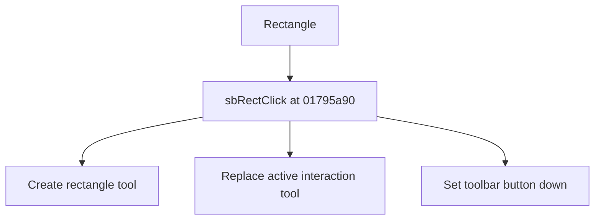

# Rectangle

> Analysis status: Source reviewed for TIARA-diz.6.7.1599.

## Control

| Property | Recovered value |
| --- | --- |
| Form | ShapeEdit |
| Component path | ShapeEdit.TopToolBar.EditorTools.sbRect |
| Control class | TSpeedButton |
| Caption | Rectangle |
| Hint | Rectangle |
| Handler name | sbRectClick |
| Handler address | 01795a90 |
| Graph node | `resource:dfm:ShapeEdit/ShapeEdit.TopToolBar.EditorTools.sbRect` |
| Handler node | `function:01795a90` |

## What happens when clicked

Creates the recovered rectangle tool object, installs it as the active ShapeEdit interaction tool, and sets the corresponding toolbar button down. A previous active tool is released by the shared installation path. The shared rectangle-family tool receives mode value 0.

This control shares the recovered handler with `ShapeEdit.MainMenu.mnDraw.mnuRectangle`. This article keeps the resource evidence for this control separate.

## Click flow

## Evidence

- Handler source: [0000000001795A90__FUN_01795a90.c](../../../DecompiledSources/Tina16/functions/0000000001795A90__FUN_01795a90.c)
- Extracted glyph 1: [0407_ShapeEdit_ShapeEdit_TopToolBar_EditorTools_sbRect_Glyph_Data.png](../../../glyph/0407_ShapeEdit_ShapeEdit_TopToolBar_EditorTools_sbRect_Glyph_Data.png)
- Recovered path: The handler constructs the rectangle tool class, calls 01794b80 to replace field +0xd20, and updates the recovered speed-button state.
- Resource context: The recovered TSpeedButton resource uses caption `Rectangle` and hint `Rectangle`. The extracted glyph was visually inspected. It agrees with the recovered resource intent, but the source path remains the behavior proof.

## Analysis limits

- No additional implementation gap was found in the recovered click path.
- The caption, hint, and glyph support control identity only. They do not replace the recovered handler and callee evidence.

