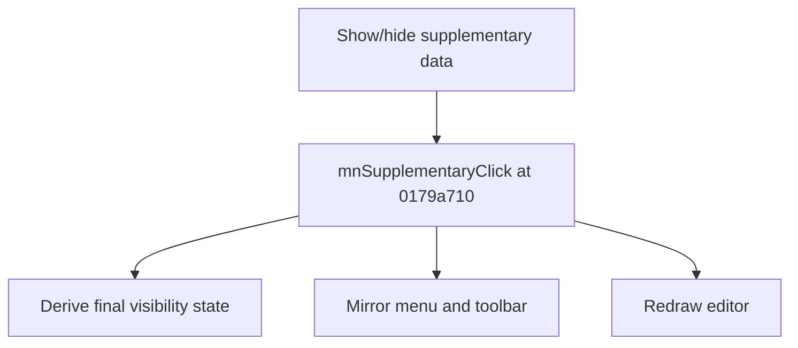

# Show/hide supplementary data

> Analysis status: Source reviewed for TIARA-diz.6.7.1601.

## Control

| Property | Recovered value |
| --- | --- |
| Form | ShapeEdit |
| Component path | ShapeEdit.TopToolBar.EditorTools.sbSupplementary |
| Control class | TSpeedButton |
| Caption | Show/hide supplementary data |
| Hint | Show/hide supplementary data |
| Handler name | mnSupplementaryClick |
| Handler address | 0179a710 |
| Graph node | `resource:dfm:ShapeEdit/ShapeEdit.TopToolBar.EditorTools.sbSupplementary` |
| Handler node | `function:0179a710` |

## What happens when clicked

Derives the final state from the menu item or toolbar sender, mirrors it between the menu checked property and toolbar down property, and redraws the editor.

This control shares the recovered handler with `ShapeEdit.MainMenu.View.mnSupplementary`. This article keeps the resource evidence for this control separate.

## Click flow

## Evidence

- Handler source: [000000000179A710__FUN_0179a710.c](../../../DecompiledSources/Tina16/functions/000000000179A710__FUN_0179a710.c)
- Extracted glyph 1: [0412_ShapeEdit_ShapeEdit_TopToolBar_EditorTools_sbSupplementary_Glyph_Data.png](../../../glyph/0412_ShapeEdit_ShapeEdit_TopToolBar_EditorTools_sbSupplementary_Glyph_Data.png)
- Recovered path: The shared handler tests Sender, reads or toggles the menu state, updates fields +0x9a8 and +0xab0, and invalidates the editor.
- Resource context: The recovered TSpeedButton resource uses caption `Show/hide supplementary data` and hint `Show/hide supplementary data`. The extracted glyph was visually inspected. It agrees with the recovered resource intent, but the source path remains the behavior proof.

## Analysis limits

- No additional implementation gap was found in the recovered click path.
- The caption, hint, and glyph support control identity only. They do not replace the recovered handler and callee evidence.

