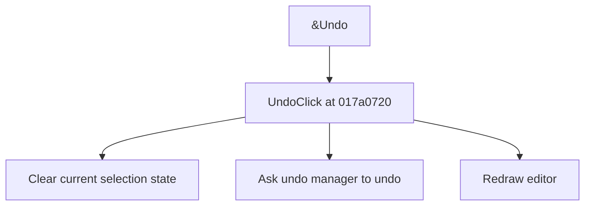

# &Undo

> Analysis status: Source reviewed for TIARA-diz.6.7.1526.

## Control

| Property | Recovered value |
| --- | --- |
| Form | ShapeEdit |
| Component path | ShapeEdit.MainMenu.Edit.Undo |
| Control class | TMenuItem |
| Caption | &Undo |
| Hint | Not present in the recovered resource. |
| Handler name | UndoClick |
| Handler address | 017a0720 |
| Graph node | `resource:dfm:ShapeEdit/ShapeEdit.MainMenu.Edit.Undo` |
| Handler node | `function:017a0720` |

## What happens when clicked

Clears the current object selection or interaction state, asks the ShapeEdit undo manager to undo one command, and redraws the editor. The undo manager determines the no-history behavior.

## Click flow

## Evidence

- Handler source: [00000000017A0720__FUN_017a0720.c](../../../DecompiledSources/Tina16/functions/00000000017A0720__FUN_017a0720.c)
- Extracted glyph: None.
- Recovered path: The handler calls 017956f0, the undo-manager function 00c5c7b0 on field +0xd50, and the editor invalidation path.
- Resource context: The recovered TMenuItem resource uses caption `&Undo`.

## Analysis limits

- The handler does not expose whether the undo stack was empty; that decision belongs to the undo manager.
- The caption, hint, and glyph support control identity only. They do not replace the recovered handler and callee evidence.

