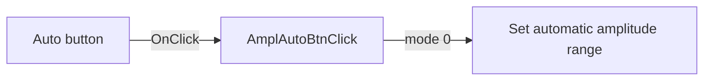

# Auto

> Analysis status: Source reviewed: the click selects automatic amplitude range control.

## Control

| Property | Recovered value |
| --- | --- |
| Form | SignalAnalyzerWin |
| Component path | SignalAnalyzerWin.MeasurementGroupBox.AmplitudeBox.AmplAutoBtn |
| Control class | TSpeedButton |
| Caption | Auto |
| Hint | Not present in the recovered resource. |
| Text | Not present in the recovered resource. |
| Handler name | AmplAutoBtnClick |
| Handler address | 0138bed0 |
| Graph node | `resource:dfm:SignalAnalyzerWin/SignalAnalyzerWin.MeasurementGroupBox.AmplitudeBox.AmplAutoBtn` |
| Handler node | `function:0138bed0` |
| Graph layer | UI |

## What happens when clicked

The handler calls the analyzer backend through virtual slot `+0xA8` with mode value `0`. The nearby Range label agrees with the amplitude-range context.

The handler contains no local decision, display update, or error branch. Those behaviors, if any, are inside the backend operation.

## Click flow

## Handler evidence

- Source: [DecompiledSources/Tina16/functions/000000000138BED0__FUN_0138bed0.c](../../../DecompiledSources/Tina16/functions/000000000138BED0__FUN_0138bed0.c)
- Recovered role: Selects automatic amplitude range control in the analyzer backend.
- Current graph summary: Handles 1 Delphi UI event: SignalAnalyzerWin.MeasurementGroupBox.AmplitudeBox.AmplAutoBtn.OnClick.
- Current graph behavior: Not present in the recovered resource.
- Current graph evidence: Not present in the recovered resource.
- Complexity: simple
- Distinct outgoing calls: 0

## Direct calls

- No direct call edge is present in the recovered graph.

## Resource evidence

- Kind: Not present in the recovered resource.
- Modal result: Not present in the recovered resource.
- Checked state: Not present in the recovered resource.
- List items: Not present in the recovered resource.
- Image reference: Not present in the recovered resource.
- Extracted glyph: None.

## Nearby label candidates

Nearby labels are layout candidates only. They are not proof of behavior.

- Rank 1: Range at distance 57.

## Analysis limits

- The recovered source does not expose the Delphi name of backend virtual slot `+0xA8`.
- Backend validation and hardware error behavior are not present in this handler.
