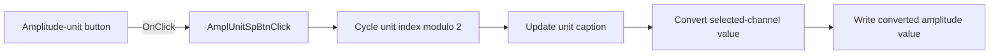

# dBm

> Analysis status: Source reviewed: the click cycles the amplitude unit and converts the displayed value.

## Control

| Property | Recovered value |
| --- | --- |
| Form | SignalAnalyzerWin |
| Component path | SignalAnalyzerWin.MeasurementGroupBox.AmplitudeBox.AmplUnitSpBtn |
| Control class | TSpeedButton |
| Caption | dBm |
| Hint | Not present in the recovered resource. |
| Text | Not present in the recovered resource. |
| Handler name | AmplUnitSpBtnClick |
| Handler address | 0138cec0 |
| Graph node | `resource:dfm:SignalAnalyzerWin/SignalAnalyzerWin.MeasurementGroupBox.AmplitudeBox.AmplUnitSpBtn` |
| Handler node | `function:0138cec0` |
| Graph layer | UI |

## What happens when clicked

The handler increments form byte `+0xE90` and wraps it modulo `2`. It changes the unit button caption through a two-entry text table.

It then asks the analyzer backend through virtual slot `+0x80` to convert the selected channel value for the new unit. The returned number is written to the amplitude value control at form field `+0xCB8`.

## Click flow

## Handler evidence

- Source: [DecompiledSources/Tina16/functions/000000000138CEC0__FUN_0138cec0.c](../../../DecompiledSources/Tina16/functions/000000000138CEC0__FUN_0138cec0.c)
- Recovered role: Cycles between two amplitude units and converts the displayed channel value.
- Current graph summary: Handles 1 Delphi UI event: SignalAnalyzerWin.MeasurementGroupBox.AmplitudeBox.AmplUnitSpBtn.OnClick.
- Current graph behavior: Not present in the recovered resource.
- Current graph evidence: Not present in the recovered resource.
- Complexity: moderate
- Distinct outgoing calls: 2

## Direct calls

- `function:0064de00` — VCL control text setter with change suppression
- `function:00b90440` — FUN_00b90440

## Resource evidence

- Kind: Not present in the recovered resource.
- Modal result: Not present in the recovered resource.
- Checked state: Not present in the recovered resource.
- List items: Not present in the recovered resource.
- Image reference: Not present in the recovered resource.
- Extracted glyph: None.

## Nearby label candidates

Nearby labels are layout candidates only. They are not proof of behavior.

- Rank 1: Range at distance 89.

## Analysis limits

- The recovered static text table does not expose both unit names in this handler source.
- The backend conversion formula and validation are not recovered.
