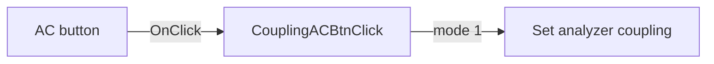

# AC

> Analysis status: Source reviewed: the click selects AC coupling for the analyzer input.

## Control

| Property | Recovered value |
| --- | --- |
| Form | SignalAnalyzerWin |
| Component path | SignalAnalyzerWin.ChannelGroupBox.CouplingGroupBox.CouplingACBtn |
| Control class | TSpeedButton |
| Caption | AC |
| Hint | Not present in the recovered resource. |
| Text | Not present in the recovered resource. |
| Handler name | CouplingACBtnClick |
| Handler address | 01389b30 |
| Graph node | `resource:dfm:SignalAnalyzerWin/SignalAnalyzerWin.ChannelGroupBox.CouplingGroupBox.CouplingACBtn` |
| Handler node | `function:01389b30` |
| Graph layer | UI |

## What happens when clicked

The handler calls the analyzer backend through virtual slot `+0x138` with mode value `1`. This is the complete recovered handler path.

The handler has no local decision or error branch. Any validation or hardware error handling is inside the backend operation.

## Click flow

## Handler evidence

- Source: [DecompiledSources/Tina16/functions/0000000001389B30__FUN_01389b30.c](../../../DecompiledSources/Tina16/functions/0000000001389B30__FUN_01389b30.c)
- Recovered role: Selects AC input coupling through the analyzer backend.
- Current graph summary: Handles 1 Delphi UI event: SignalAnalyzerWin.ChannelGroupBox.CouplingGroupBox.CouplingACBtn.OnClick.
- Current graph behavior: Not present in the recovered resource.
- Current graph evidence: Not present in the recovered resource.
- Complexity: simple
- Distinct outgoing calls: 0

## Direct calls

- No direct call edge is present in the recovered graph.

## Resource evidence

- Kind: Not present in the recovered resource.
- Modal result: Not present in the recovered resource.
- Checked state: Not present in the recovered resource.
- List items: Not present in the recovered resource.
- Image reference: Not present in the recovered resource.
- Extracted glyph: None.

## Nearby label candidates

Nearby labels are layout candidates only. They are not proof of behavior.

- No same-parent label candidate is available.

## Analysis limits

- The recovered source does not expose the Delphi name of the backend virtual method.
- Backend validation and hardware error behavior are not present in this handler.
