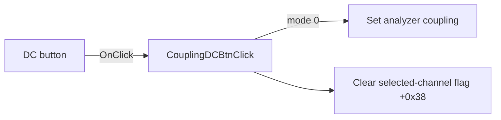

# DC

> Analysis status: Source reviewed: the click selects DC coupling and clears one selected-channel state flag.

## Control

| Property | Recovered value |
| --- | --- |
| Form | SignalAnalyzerWin |
| Component path | SignalAnalyzerWin.ChannelGroupBox.CouplingGroupBox.CouplingDCBtn |
| Control class | TSpeedButton |
| Caption | DC |
| Hint | Not present in the recovered resource. |
| Text | Not present in the recovered resource. |
| Handler name | CouplingDCBtnClick |
| Handler address | 01389b00 |
| Graph node | `resource:dfm:SignalAnalyzerWin/SignalAnalyzerWin.ChannelGroupBox.CouplingGroupBox.CouplingDCBtn` |
| Handler node | `function:01389b00` |
| Graph layer | UI |

## What happens when clicked

The handler calls the analyzer backend through virtual slot `+0x138` with mode value `0`. It then clears byte `+0x38` in the selected channel model at form field `+0x870`.

The source proves the backend request and the state write. It does not identify the Delphi name of the cleared model field.

## Click flow

## Handler evidence

- Source: [DecompiledSources/Tina16/functions/0000000001389B00__FUN_01389b00.c](../../../DecompiledSources/Tina16/functions/0000000001389B00__FUN_01389b00.c)
- Recovered role: Selects DC input coupling and clears a selected-channel model flag.
- Current graph summary: Handles 1 Delphi UI event: SignalAnalyzerWin.ChannelGroupBox.CouplingGroupBox.CouplingDCBtn.OnClick.
- Current graph behavior: Not present in the recovered resource.
- Current graph evidence: Not present in the recovered resource.
- Complexity: simple
- Distinct outgoing calls: 0

## Direct calls

- No direct call edge is present in the recovered graph.

## Resource evidence

- Kind: Not present in the recovered resource.
- Modal result: Not present in the recovered resource.
- Checked state: Not present in the recovered resource.
- List items: Not present in the recovered resource.
- Image reference: Not present in the recovered resource.
- Extracted glyph: None.

## Nearby label candidates

Nearby labels are layout candidates only. They are not proof of behavior.

- No same-parent label candidate is available.

## Analysis limits

- The Delphi name and purpose of selected-channel byte `+0x38` are not recovered.
- Backend validation and hardware error behavior are not present in this handler.
