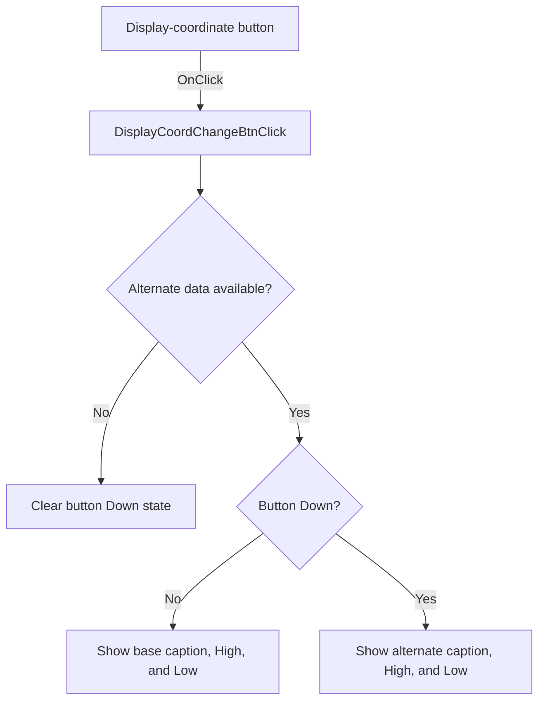

# dB

> Analysis status: Source reviewed: the click switches the displayed coordinate data set.

## Control

| Property | Recovered value |
| --- | --- |
| Form | SignalAnalyzerWin |
| Component path | SignalAnalyzerWin.DisplayGroupBox.DisplayCoordChangeBtn |
| Control class | TSpeedButton |
| Caption | dB |
| Hint | Not present in the recovered resource. |
| Text | Not present in the recovered resource. |
| Handler name | DisplayCoordChangeBtnClick |
| Handler address | 0138c870 |
| Graph node | `resource:dfm:SignalAnalyzerWin/SignalAnalyzerWin.DisplayGroupBox.DisplayCoordChangeBtn` |
| Handler node | `function:0138c870` |
| Graph layer | UI |

## What happens when clicked

The handler gets the base display data and an optional alternate data object. If the alternate object is absent, it clears this button's Down state.

When alternate data exists, the button's Down state selects which object's caption, High value, and Low value are copied to the display controls. The nearby High and Low labels support the two numeric field assignments. The handler does not persist the selection.

## Click flow

## Handler evidence

- Source: [DecompiledSources/Tina16/functions/000000000138C870__FUN_0138c870.c](../../../DecompiledSources/Tina16/functions/000000000138C870__FUN_0138c870.c)
- Recovered role: Switches the coordinate caption and High/Low values between base and alternate display data.
- Current graph summary: Handles 1 Delphi UI event: SignalAnalyzerWin.DisplayGroupBox.DisplayCoordChangeBtn.OnClick.
- Current graph behavior: Not present in the recovered resource.
- Current graph evidence: Not present in the recovered resource.
- Complexity: complex
- Distinct outgoing calls: 3

## Direct calls

- `function:0064de00` — VCL control text setter with change suppression
- `function:0082a6c0` — FUN_0082a6c0
- `function:00b90440` — FUN_00b90440

## Resource evidence

- Kind: Not present in the recovered resource.
- Modal result: Not present in the recovered resource.
- Checked state: Not present in the recovered resource.
- List items: Not present in the recovered resource.
- Image reference: Not present in the recovered resource.
- Extracted glyph: None.

## Nearby label candidates

Nearby labels are layout candidates only. They are not proof of behavior.

- Rank 1: High at distance 19.
- Rank 2: Low at distance 19.

## Analysis limits

- The recovered source does not name the two coordinate systems.
- The click updates displayed controls only; no persistence or backend write is visible.
