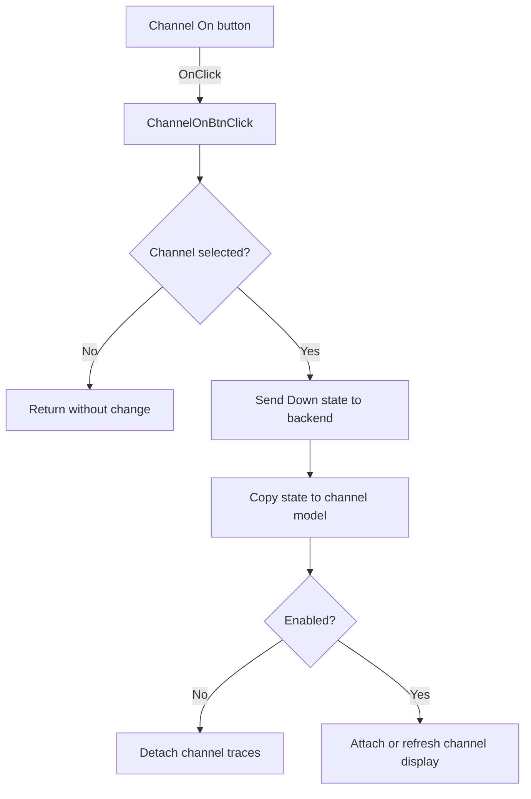

# On

> Analysis status: Source reviewed: the click enables or disables the selected analyzer channel.

## Control

| Property | Recovered value |
| --- | --- |
| Form | SignalAnalyzerWin |
| Component path | SignalAnalyzerWin.ChannelGroupBox.FChannelOnBtn |
| Control class | TSpeedButton |
| Caption | On |
| Hint | Not present in the recovered resource. |
| Text | Not present in the recovered resource. |
| Handler name | ChannelOnBtnClick |
| Handler address | 01389b50 |
| Graph node | `resource:dfm:SignalAnalyzerWin/SignalAnalyzerWin.ChannelGroupBox.FChannelOnBtn` |
| Handler node | `function:01389b50` |
| Graph layer | UI |

## What happens when clicked

The handler reads the selected channel index. If the index is `-1`, it returns without a state change. Otherwise, it sends the button's Down state to the analyzer backend and copies that state to byte `+0x11` in the selected channel model.

When the state is off, `FUN_010f6740` detaches the channel's primary and secondary trace resources. When the state is on, the form's virtual update path attaches or refreshes the channel display.

## Click flow

## Handler evidence

- Source: [DecompiledSources/Tina16/functions/0000000001389B50__FUN_01389b50.c](../../../DecompiledSources/Tina16/functions/0000000001389B50__FUN_01389b50.c)
- Recovered role: Applies the Channel On state to the selected analyzer channel and its traces.
- Current graph summary: Handles 1 Delphi UI event: SignalAnalyzerWin.ChannelGroupBox.FChannelOnBtn.OnClick.
- Current graph behavior: Not present in the recovered resource.
- Current graph evidence: Not present in the recovered resource.
- Complexity: simple
- Distinct outgoing calls: 1

## Direct calls

- `function:010f6740` — FUN_010f6740

## Resource evidence

- Kind: Not present in the recovered resource.
- Modal result: Not present in the recovered resource.
- Checked state: Not present in the recovered resource.
- List items: Not present in the recovered resource.
- Image reference: Not present in the recovered resource.
- Extracted glyph: None.

## Nearby label candidates

Nearby labels are layout candidates only. They are not proof of behavior.

- No same-parent label candidate is available.

## Analysis limits

- The selected-channel field names are not recovered; the source identifies them by offsets.
- Hardware-side validation and errors are handled outside the recovered click path.
