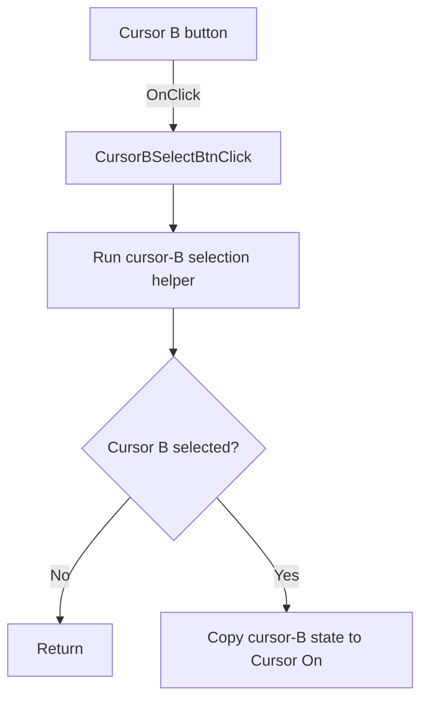

# B

> Analysis status: Source reviewed: the click selects cursor B and synchronizes the common cursor state.

## Control

| Property | Recovered value |
| --- | --- |
| Form | SignalAnalyzerWin |
| Component path | SignalAnalyzerWin.CursorBox.FCursorBSelectBtn |
| Control class | TSpeedButton |
| Caption | B |
| Hint | Not present in the recovered resource. |
| Text | Not present in the recovered resource. |
| Handler name | CursorBSelectBtnClick |
| Handler address | 0138cbf0 |
| Graph node | `resource:dfm:SignalAnalyzerWin/SignalAnalyzerWin.CursorBox.FCursorBSelectBtn` |
| Handler node | `function:0138cbf0` |
| Graph layer | UI |

## What happens when clicked

The handler calls the cursor-B selection helper. If the cursor-B button is not Down after that call, the handler returns without another change.

If cursor B is selected, the handler reads cursor-B model byte `+0xC1` and copies it to the common Cursor On button. This keeps the shared cursor toggle aligned with cursor B's active state.

## Click flow

## Handler evidence

- Source: [DecompiledSources/Tina16/functions/000000000138CBF0__FUN_0138cbf0.c](../../../DecompiledSources/Tina16/functions/000000000138CBF0__FUN_0138cbf0.c)
- Recovered role: Selects cursor B and synchronizes the common Cursor On button.
- Current graph summary: Handles 1 Delphi UI event: SignalAnalyzerWin.CursorBox.FCursorBSelectBtn.OnClick.
- Current graph behavior: Not present in the recovered resource.
- Current graph evidence: Not present in the recovered resource.
- Complexity: simple
- Distinct outgoing calls: 1

## Direct calls

- `function:010f7e40` — FUN_010f7e40

## Resource evidence

- Kind: Not present in the recovered resource.
- Modal result: Not present in the recovered resource.
- Checked state: Not present in the recovered resource.
- List items: Not present in the recovered resource.
- Image reference: Not present in the recovered resource.
- Extracted glyph: None.

## Nearby label candidates

Nearby labels are layout candidates only. They are not proof of behavior.

- No same-parent label candidate is available.

## Analysis limits

- The handler does not itself create, move, or remove a cursor.
- The Delphi names of the cursor model bytes are not recovered.
