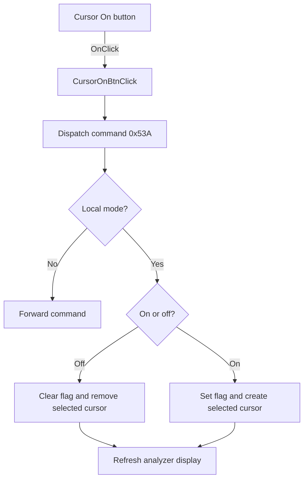

# On

> Analysis status: Source reviewed: the click turns the selected cursor on or off.

## Control

| Property | Recovered value |
| --- | --- |
| Form | SignalAnalyzerWin |
| Component path | SignalAnalyzerWin.CursorBox.FCursorOnBtn |
| Control class | TSpeedButton |
| Caption | On |
| Hint | Not present in the recovered resource. |
| Text | Not present in the recovered resource. |
| Handler name | CursorOnBtnClick |
| Handler address | 0138cbd0 |
| Graph node | `resource:dfm:SignalAnalyzerWin/SignalAnalyzerWin.CursorBox.FCursorOnBtn` |
| Handler node | `function:0138cbd0` |
| Graph layer | UI |

## What happens when clicked

The handler dispatches cursor command `0x53A`. In local mode, the command reads the common Cursor On state and the selected A or B button.

Turning a selected cursor off clears its model flag and removes the cursor through `FUN_010e7ec0`. Turning it on sets the flag and creates the cursor for the active trace through `FUN_010e7c50`. The path then refreshes the analyzer display. In remote mode, it forwards the command instead of making the local change.

## Click flow

## Handler evidence

- Source: [DecompiledSources/Tina16/functions/000000000138CBD0__FUN_0138cbd0.c](../../../DecompiledSources/Tina16/functions/000000000138CBD0__FUN_0138cbd0.c)
- Recovered role: Turns the selected analyzer cursor on or off through the local or remote command path.
- Current graph summary: Handles 1 Delphi UI event: SignalAnalyzerWin.CursorBox.FCursorOnBtn.OnClick.
- Current graph behavior: Not present in the recovered resource.
- Current graph evidence: Not present in the recovered resource.
- Complexity: simple
- Distinct outgoing calls: 1

## Direct calls

- `function:010f7c00` — FUN_010f7c00

## Resource evidence

- Kind: Not present in the recovered resource.
- Modal result: Not present in the recovered resource.
- Checked state: Not present in the recovered resource.
- List items: Not present in the recovered resource.
- Image reference: Not present in the recovered resource.
- Extracted glyph: None.

## Nearby label candidates

Nearby labels are layout candidates only. They are not proof of behavior.

- No same-parent label candidate is available.

## Analysis limits

- If neither cursor-selection button is active, the recovered local path has no selected cursor to change.
- The command transport reports errors outside the click handler.
