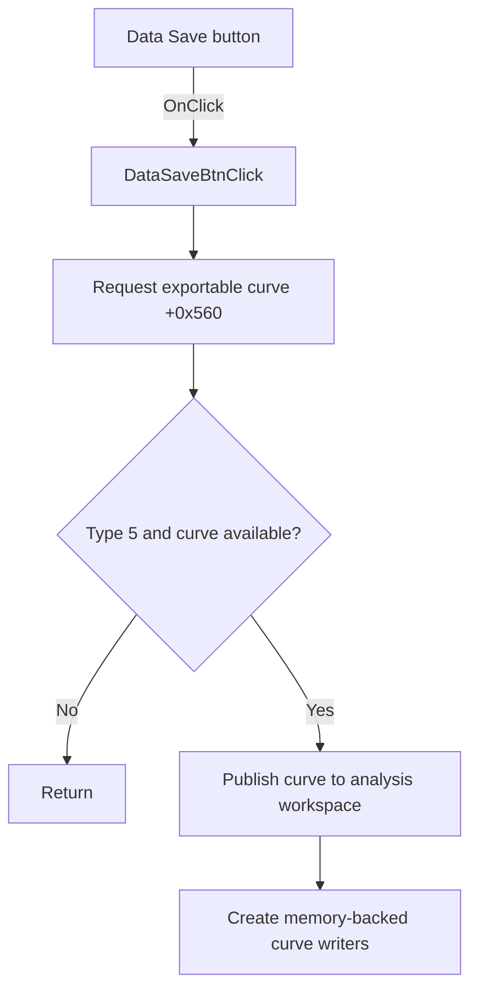

# FDataSaveBtn

> Analysis status: Source reviewed: the click publishes the current curve to the analysis workspace.

## Control

| Property | Recovered value |
| --- | --- |
| Form | SignalAnalyzerWin |
| Component path | SignalAnalyzerWin.DataBox.FDataSaveBtn |
| Control class | TSpeedButton |
| Caption | Not present in the recovered resource. |
| Hint | Not present in the recovered resource. |
| Text | Not present in the recovered resource. |
| Handler name | DataSaveBtnClick |
| Handler address | 0138cc10 |
| Graph node | `resource:dfm:SignalAnalyzerWin/SignalAnalyzerWin.DataBox.FDataSaveBtn` |
| Handler node | `function:0138cc10` |
| Graph layer | UI |

## What happens when clicked

The handler calls `FUN_010f7ea0`. That callee asks the form for an exportable curve through virtual slot `+0x560`. It continues only when analyzer type byte `+0x7FA` is `5` and the returned curve is not null.

On success, it installs the curve as the application's current analysis source, clears the nested current-curve slot, and creates two curve-writer support objects with memory storage. The path does not itself open a save dialog. The plot-and-right-arrow glyph supports the export direction.

## Click flow

## Handler evidence

- Source: [DecompiledSources/Tina16/functions/000000000138CC10__FUN_0138cc10.c](../../../DecompiledSources/Tina16/functions/000000000138CC10__FUN_0138cc10.c)
- Recovered role: Publishes an exportable analyzer curve to the application's analysis workspace.
- Current graph summary: Handles 1 Delphi UI event: SignalAnalyzerWin.DataBox.FDataSaveBtn.OnClick.
- Current graph behavior: Not present in the recovered resource.
- Current graph evidence: Not present in the recovered resource.
- Complexity: simple
- Distinct outgoing calls: 1

## Direct calls

- `function:010f7ea0` — FUN_010f7ea0

## Resource evidence

- Kind: Not present in the recovered resource.
- Modal result: Not present in the recovered resource.
- Checked state: Not present in the recovered resource.
- List items: Not present in the recovered resource.
- Image reference: Not present in the recovered resource.
- Extracted glyph: [`0451_SignalAnalyzerWin_SignalAnalyzerWin_DataBox_FDataSaveBtn_Glyph_Data.png`](../../../glyph/0451_SignalAnalyzerWin_SignalAnalyzerWin_DataBox_FDataSaveBtn_Glyph_Data.png)

## Nearby label candidates

Nearby labels are layout candidates only. They are not proof of behavior.

- No same-parent label candidate is available.

## Analysis limits

- The click path does not prove that a file is written or that a save dialog opens.
- The roles of the two created curve-writer support objects are only partly recovered.
