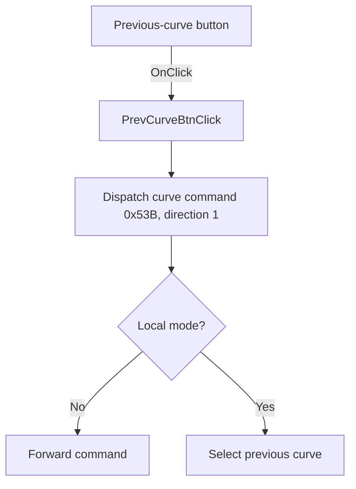

# FPrevCurveBtn

> Analysis status: Source reviewed: the click selects the previous analyzer curve.

## Control

| Property | Recovered value |
| --- | --- |
| Form | SignalAnalyzerWin |
| Component path | SignalAnalyzerWin.CursorBox.FPrevCurveBtn |
| Control class | TSpeedButton |
| Caption | Not present in the recovered resource. |
| Hint | Not present in the recovered resource. |
| Text | Not present in the recovered resource. |
| Handler name | PrevCurveBtnClick |
| Handler address | 0138ca10 |
| Graph node | `resource:dfm:SignalAnalyzerWin/SignalAnalyzerWin.CursorBox.FPrevCurveBtn` |
| Handler node | `function:0138ca10` |
| Graph layer | UI |

## What happens when clicked

The handler calls `FUN_010f6d40`. That helper dispatches curve-selection command `0x53B` with direction value `1`.

The common command selects the previous user-facing curve in local mode or forwards the request in remote mode. The extracted upward-arrow glyph supports the navigation meaning; the command value and handler pairing provide the implementation evidence.

## Click flow

## Handler evidence

- Source: [DecompiledSources/Tina16/functions/000000000138CA10__FUN_0138ca10.c](../../../DecompiledSources/Tina16/functions/000000000138CA10__FUN_0138ca10.c)
- Recovered role: Selects the previous analyzer curve through the common curve command.
- Current graph summary: Handles 1 Delphi UI event: SignalAnalyzerWin.CursorBox.FPrevCurveBtn.OnClick.
- Current graph behavior: Not present in the recovered resource.
- Current graph evidence: Not present in the recovered resource.
- Complexity: simple
- Distinct outgoing calls: 1

## Direct calls

- `function:010f6d40` — FUN_010f6d40

## Resource evidence

- Kind: Not present in the recovered resource.
- Modal result: Not present in the recovered resource.
- Checked state: Not present in the recovered resource.
- List items: Not present in the recovered resource.
- Image reference: Not present in the recovered resource.
- Extracted glyph: [`0465_SignalAnalyzerWin_SignalAnalyzerWin_CursorBox_FPrevCurveBtn_Glyph_Data.png`](../../../glyph/0465_SignalAnalyzerWin_SignalAnalyzerWin_CursorBox_FPrevCurveBtn_Glyph_Data.png)

## Nearby label candidates

Nearby labels are layout candidates only. They are not proof of behavior.

- No same-parent label candidate is available.

## Analysis limits

- The recovered callee does not provide the original Delphi enumeration name for direction value `1`.
- The handler does not expose errors from the remote command transport.
