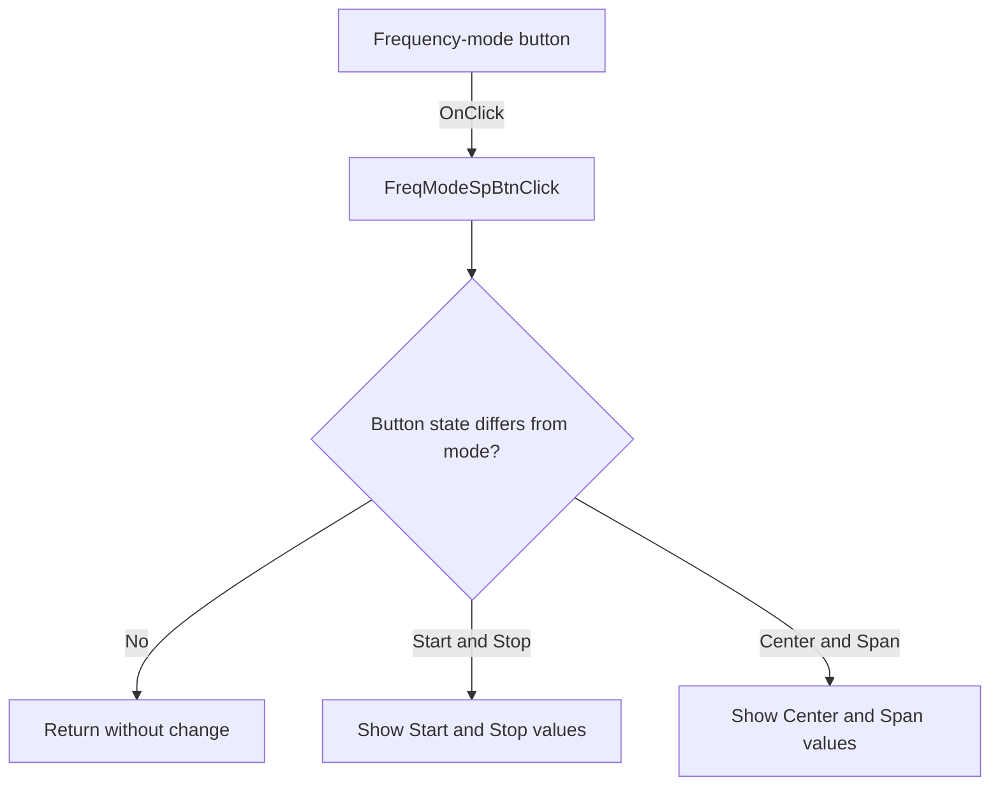

# FreqModeSpBtn

> Analysis status: Source reviewed: the click switches between start-stop and center-span frequency fields.

## Control

| Property | Recovered value |
| --- | --- |
| Form | SignalAnalyzerWin |
| Component path | SignalAnalyzerWin.MeasurementGroupBox.FrequencyGroupBox.FreqModeSpBtn |
| Control class | TSpeedButton |
| Caption | Not present in the recovered resource. |
| Hint | Not present in the recovered resource. |
| Text | Not present in the recovered resource. |
| Handler name | FreqModeSpBtnClick |
| Handler address | 0138cc30 |
| Graph node | `resource:dfm:SignalAnalyzerWin/SignalAnalyzerWin.MeasurementGroupBox.FrequencyGroupBox.FreqModeSpBtn` |
| Handler node | `function:0138cc30` |
| Graph layer | UI |

## What happens when clicked

The handler compares the button's Down state with internal mode byte `+0xE4A`. A change to the first mode sets the byte to `1`, changes the two field captions to Start and Stop, and loads saved values from `+0xE50` and `+0xE58`.

A change to the other mode sets the byte to `0`, changes the captions to Center and Span, and loads values from `+0xE60` and `+0xE68`. If the button state already matches the internal mode, the handler returns without a change. The four-part frequency glyph and nearby labels agree with this switch.

## Click flow

## Handler evidence

- Source: [DecompiledSources/Tina16/functions/000000000138CC30__FUN_0138cc30.c](../../../DecompiledSources/Tina16/functions/000000000138CC30__FUN_0138cc30.c)
- Recovered role: Switches the frequency editors between Start/Stop and Center/Span representations.
- Current graph summary: Handles 1 Delphi UI event: SignalAnalyzerWin.MeasurementGroupBox.FrequencyGroupBox.FreqModeSpBtn.OnClick.
- Current graph behavior: Not present in the recovered resource.
- Current graph evidence: Not present in the recovered resource.
- Complexity: moderate
- Distinct outgoing calls: 2

## Direct calls

- `function:0064de00` — VCL control text setter with change suppression
- `function:00b90440` — FUN_00b90440

## Resource evidence

- Kind: Not present in the recovered resource.
- Modal result: Not present in the recovered resource.
- Checked state: Not present in the recovered resource.
- List items: Not present in the recovered resource.
- Image reference: Not present in the recovered resource.
- Extracted glyph: [`0455_SignalAnalyzerWin_SignalAnalyzerWin_MeasurementGroupBox_FrequencyGroupBox_FreqModeSpBtn_Glyph_Data.png`](../../../glyph/0455_SignalAnalyzerWin_SignalAnalyzerWin_MeasurementGroupBox_FrequencyGroupBox_FreqModeSpBtn_Glyph_Data.png)

## Nearby label candidates

Nearby labels are layout candidates only. They are not proof of behavior.

- Rank 1: Stop at distance 35.
- Rank 2: Resolution at distance 59.
- Rank 3: Start at distance 66.

## Analysis limits

- The handler updates the editor representation; it does not itself apply the values to hardware.
- The recovered source identifies the saved numeric fields by offsets only.
