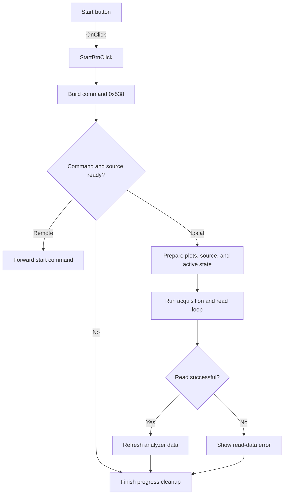

# Start

> Analysis status: Source reviewed: the click starts an analyzer measurement through command 0x538.

## Control

| Property | Recovered value |
| --- | --- |
| Form | SignalAnalyzerWin |
| Component path | SignalAnalyzerWin.MeasurementGroupBox.FStartBtn |
| Control class | TSpeedButton |
| Caption | Start |
| Hint | Not present in the recovered resource. |
| Text | Not present in the recovered resource. |
| Handler name | StartBtnClick |
| Handler address | 0138afc0 |
| Graph node | `resource:dfm:SignalAnalyzerWin/SignalAnalyzerWin.MeasurementGroupBox.FStartBtn` |
| Handler node | `function:0138afc0` |
| Graph layer | UI |

## What happens when clicked

The handler builds command descriptor `0x538` and enters the measurement start state machine in `FUN_0138aff0`. The state machine validates command order and readiness. It forwards the request in remote mode or prepares local plots, data, cursor state, progress state, and the analyzer source.

For a local start, it marks measurement active, disables relevant controls, configures the source for the active analyzer mode, and runs the acquisition and read loop. It refreshes display data after successful reads. A read failure shows `Signal Analyzer: Read Data Failed!`. The cleanup path stops or finalizes the source, re-enables controls, clears the active flag, and closes the progress UI.

## Click flow

## Handler evidence

- Source: [DecompiledSources/Tina16/functions/000000000138AFC0__FUN_0138afc0.c](../../../DecompiledSources/Tina16/functions/000000000138AFC0__FUN_0138afc0.c)
- Recovered role: Starts and manages the analyzer measurement acquisition state machine.
- Current graph summary: Handles 1 Delphi UI event: SignalAnalyzerWin.MeasurementGroupBox.FStartBtn.OnClick.
- Current graph behavior: Not present in the recovered resource.
- Current graph evidence: Not present in the recovered resource.
- Complexity: simple
- Distinct outgoing calls: 1

## Direct calls

- `function:0138aff0` — FUN_0138aff0

## Resource evidence

- Kind: Not present in the recovered resource.
- Modal result: Not present in the recovered resource.
- Checked state: Not present in the recovered resource.
- List items: Not present in the recovered resource.
- Image reference: Not present in the recovered resource.
- Extracted glyph: None.

## Nearby label candidates

Nearby labels are layout candidates only. They are not proof of behavior.

- Rank 1: Mode at distance 56.

## Analysis limits

- Many recovered form fields and backend virtual methods are known only by offsets.
- Source-specific hardware errors other than the recovered read-data message occur inside called operations.
