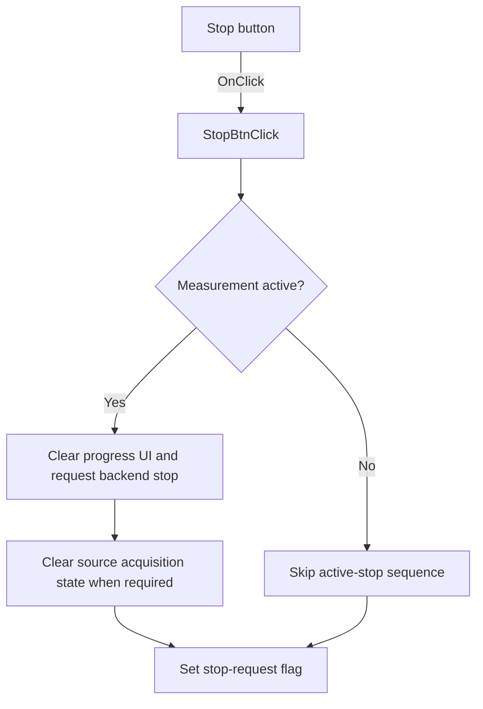

# Stop

> Analysis status: Source reviewed: the click requests that the active analyzer measurement stop.

## Control

| Property | Recovered value |
| --- | --- |
| Form | SignalAnalyzerWin |
| Component path | SignalAnalyzerWin.MeasurementGroupBox.FStopBtn |
| Control class | TSpeedButton |
| Caption | Stop |
| Hint | Not present in the recovered resource. |
| Text | Not present in the recovered resource. |
| Handler name | StopBtnClick |
| Handler address | 0138ba20 |
| Graph node | `resource:dfm:SignalAnalyzerWin/SignalAnalyzerWin.MeasurementGroupBox.FStopBtn` |
| Handler node | `function:0138ba20` |
| Graph layer | UI |

## What happens when clicked

If measurement-active byte `+0x7ED` is set, the handler clears the progress UI, updates progress or status, and calls analyzer backend virtual slot `+0x180` to request a stop. For analyzer modes `4` or `8`, it can also clear the active acquisition state in the selected source object.

The handler always sets stop-request byte `+0x7EC` to `1`. Therefore, when no measurement is active, the click only records the stop request and does not run the backend stop sequence.

## Click flow

## Handler evidence

- Source: [DecompiledSources/Tina16/functions/000000000138BA20__FUN_0138ba20.c](../../../DecompiledSources/Tina16/functions/000000000138BA20__FUN_0138ba20.c)
- Recovered role: Requests measurement stop and clears active acquisition state when a measurement is running.
- Current graph summary: Handles 1 Delphi UI event: SignalAnalyzerWin.MeasurementGroupBox.FStopBtn.OnClick.
- Current graph behavior: Not present in the recovered resource.
- Current graph evidence: Not present in the recovered resource.
- Complexity: complex
- Distinct outgoing calls: 7

## Direct calls

- `function:004113f0` — FUN_004113f0
- `function:0065b870` — FUN_0065b870
- `function:010e1a60` — FUN_010e1a60
- `function:010e1b10` — FUN_010e1b10
- `function:010e4300` — FUN_010e4300
- `function:010e4410` — FUN_010e4410
- `function:011390a0` — FUN_011390a0

## Resource evidence

- Kind: Not present in the recovered resource.
- Modal result: Not present in the recovered resource.
- Checked state: Not present in the recovered resource.
- List items: Not present in the recovered resource.
- Image reference: Not present in the recovered resource.
- Extracted glyph: None.

## Nearby label candidates

Nearby labels are layout candidates only. They are not proof of behavior.

- Rank 1: Mode at distance 106.

## Analysis limits

- The Delphi names of active byte `+0x7ED` and stop-request byte `+0x7EC` are not recovered.
- Backend stop failures are not handled directly in this click handler.
