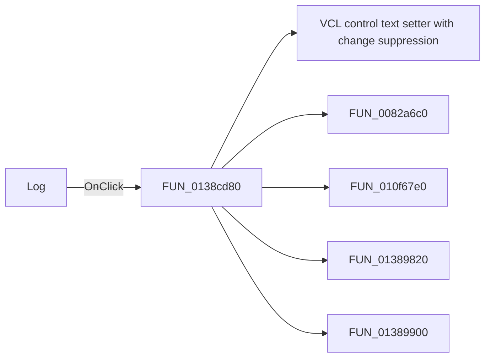

# Log

> Analysis status: Pending individual source review.

## Control

| Property | Recovered value |
| --- | --- |
| Form | SignalAnalyzerWin |
| Component path | SignalAnalyzerWin.MeasurementGroupBox.FrequencyGroupBox.LinLogSpBtn |
| Control class | TSpeedButton |
| Caption | Log |
| Hint | Not present in the recovered resource. |
| Text | Not present in the recovered resource. |
| Handler name | LinLogSpBtnClick |
| Handler address | 0138cd80 |
| Graph node | `resource:dfm:SignalAnalyzerWin/SignalAnalyzerWin.MeasurementGroupBox.FrequencyGroupBox.LinLogSpBtn` |
| Handler node | `function:0138cd80` |
| Graph layer | UI |

## What happens when clicked

Pending individual analysis. An agent must read the recovered handler source and its relevant callees before it replaces this text.

## Click flow

## Handler evidence

- Source: [DecompiledSources/Tina16/functions/000000000138CD80__FUN_0138cd80.c](../../../DecompiledSources/Tina16/functions/000000000138CD80__FUN_0138cd80.c)
- Recovered role: Not present in the recovered resource.
- Current graph summary: Handles 1 Delphi UI event: SignalAnalyzerWin.MeasurementGroupBox.FrequencyGroupBox.LinLogSpBtn.OnClick.
- Current graph behavior: Not present in the recovered resource.
- Current graph evidence: Not present in the recovered resource.
- Complexity: complex
- Distinct outgoing calls: 5

## Direct calls

- `function:0064de00` — VCL control text setter with change suppression
- `function:0082a6c0` — FUN_0082a6c0
- `function:010f67e0` — FUN_010f67e0
- `function:01389820` — FUN_01389820
- `function:01389900` — FUN_01389900

## Resource evidence

- Kind: Not present in the recovered resource.
- Modal result: Not present in the recovered resource.
- Checked state: Not present in the recovered resource.
- List items: Not present in the recovered resource.
- Image reference: Not present in the recovered resource.
- Extracted glyph: None.

## Nearby label candidates

Nearby labels are layout candidates only. They are not proof of behavior.

- Rank 1: [Hz] at distance 70.
- Rank 2: Resolution at distance 85.
- Rank 3: Stop at distance 109.

## Analysis limits

- Do not infer behavior from the control class, caption, hint, glyph, or nearby label alone.
- Do not replace the pending status until the handler source and relevant call path provide enough evidence.
