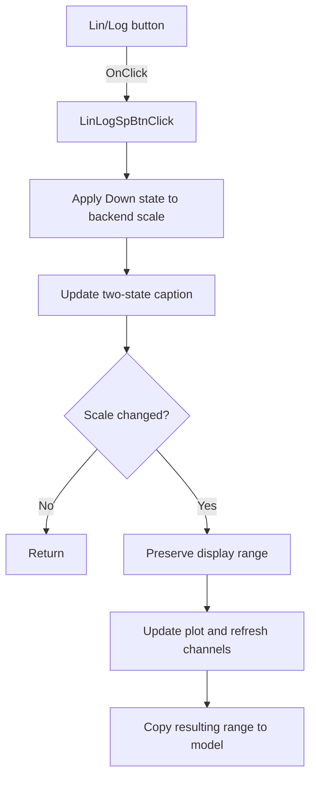

# Log

> Analysis status: Source reviewed: the click switches the analyzer scale between linear and logarithmic modes.

## Control

| Property | Recovered value |
| --- | --- |
| Form | SignalAnalyzerWin |
| Component path | SignalAnalyzerWin.MeasurementGroupBox.FrequencyGroupBox.LinLogSpBtn |
| Control class | TSpeedButton |
| Caption | Log |
| Hint | Not present in the recovered resource. |
| Text | Not present in the recovered resource. |
| Handler name | LinLogSpBtnClick |
| Handler address | 0138cd80 |
| Graph node | `resource:dfm:SignalAnalyzerWin/SignalAnalyzerWin.MeasurementGroupBox.FrequencyGroupBox.LinLogSpBtn` |
| Handler node | `function:0138cd80` |
| Graph layer | UI |

## What happens when clicked

The handler reads the current backend display configuration, copies this button's Down state to scale byte `+0xE74`, and applies the new linear or logarithmic setting through backend virtual slots `+0x130` and `+0x120`. It also updates the button state and its two-state caption.

If the scale changed, the handler preserves the display range, updates the plot object, refreshes all analyzer channels through `FUN_010f67e0`, and copies the resulting range back to the data model. If the scale did not change, it skips that refresh sequence.

## Click flow

## Handler evidence

- Source: [DecompiledSources/Tina16/functions/000000000138CD80__FUN_0138cd80.c](../../../DecompiledSources/Tina16/functions/000000000138CD80__FUN_0138cd80.c)
- Recovered role: Applies linear or logarithmic analyzer scaling and refreshes the plot when the mode changes.
- Current graph summary: Handles 1 Delphi UI event: SignalAnalyzerWin.MeasurementGroupBox.FrequencyGroupBox.LinLogSpBtn.OnClick.
- Current graph behavior: Not present in the recovered resource.
- Current graph evidence: Not present in the recovered resource.
- Complexity: complex
- Distinct outgoing calls: 5

## Direct calls

- `function:0064de00` — VCL control text setter with change suppression
- `function:0082a6c0` — FUN_0082a6c0
- `function:010f67e0` — FUN_010f67e0
- `function:01389820` — FUN_01389820
- `function:01389900` — FUN_01389900

## Resource evidence

- Kind: Not present in the recovered resource.
- Modal result: Not present in the recovered resource.
- Checked state: Not present in the recovered resource.
- List items: Not present in the recovered resource.
- Image reference: Not present in the recovered resource.
- Extracted glyph: None.

## Nearby label candidates

Nearby labels are layout candidates only. They are not proof of behavior.

- Rank 1: [Hz] at distance 70.
- Rank 2: Resolution at distance 85.
- Rank 3: Stop at distance 109.

## Analysis limits

- The recovered static string addresses do not decode both caption texts in this handler file.
- The exact scaling calculations occur in backend and plot methods whose Delphi names are not recovered.
