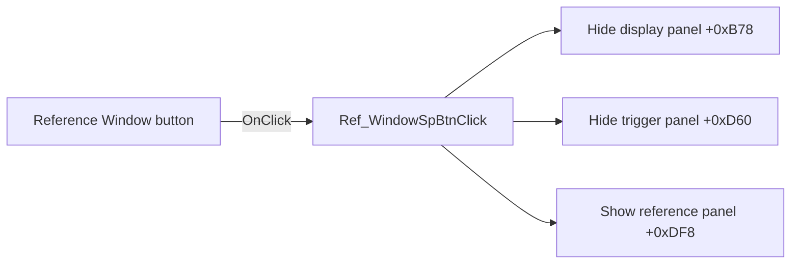

# Ref.-Window

> Analysis status: Source reviewed: the click shows the reference-window panel.

## Control

| Property | Recovered value |
| --- | --- |
| Form | SignalAnalyzerWin |
| Component path | SignalAnalyzerWin.ControlGroupBox.Ref_WindowSpBtn |
| Control class | TSpeedButton |
| Caption | Ref.-Window |
| Hint | Not present in the recovered resource. |
| Text | Not present in the recovered resource. |
| Handler name | Ref_WindowSpBtnClick |
| Handler address | 0138d3d0 |
| Graph node | `resource:dfm:SignalAnalyzerWin/SignalAnalyzerWin.ControlGroupBox.Ref_WindowSpBtn` |
| Handler node | `function:0138d3d0` |
| Graph layer | UI |

## What happens when clicked

The handler hides the display-control panel at form field `+0xB78` and the trigger-control panel at `+0xD60`. It then shows the reference-window panel at `+0xDF8`.

The handler changes panel visibility only. It does not modify the reference value.

## Click flow

## Handler evidence

- Source: [DecompiledSources/Tina16/functions/000000000138D3D0__FUN_0138d3d0.c](../../../DecompiledSources/Tina16/functions/000000000138D3D0__FUN_0138d3d0.c)
- Recovered role: Shows the reference-window panel and hides the other inline control panels.
- Current graph summary: Handles 1 Delphi UI event: SignalAnalyzerWin.ControlGroupBox.Ref_WindowSpBtn.OnClick.
- Current graph behavior: Not present in the recovered resource.
- Current graph evidence: Not present in the recovered resource.
- Complexity: simple
- Distinct outgoing calls: 1

## Direct calls

- `function:0064dbe0` — FUN_0064dbe0

## Resource evidence

- Kind: Not present in the recovered resource.
- Modal result: Not present in the recovered resource.
- Checked state: Not present in the recovered resource.
- List items: Not present in the recovered resource.
- Image reference: Not present in the recovered resource.
- Extracted glyph: None.

## Nearby label candidates

Nearby labels are layout candidates only. They are not proof of behavior.

- No same-parent label candidate is available.

## Analysis limits

- The recovered field offsets do not provide the original Delphi panel names.
- The click does not prove a change to any reference value or analyzer setting.
