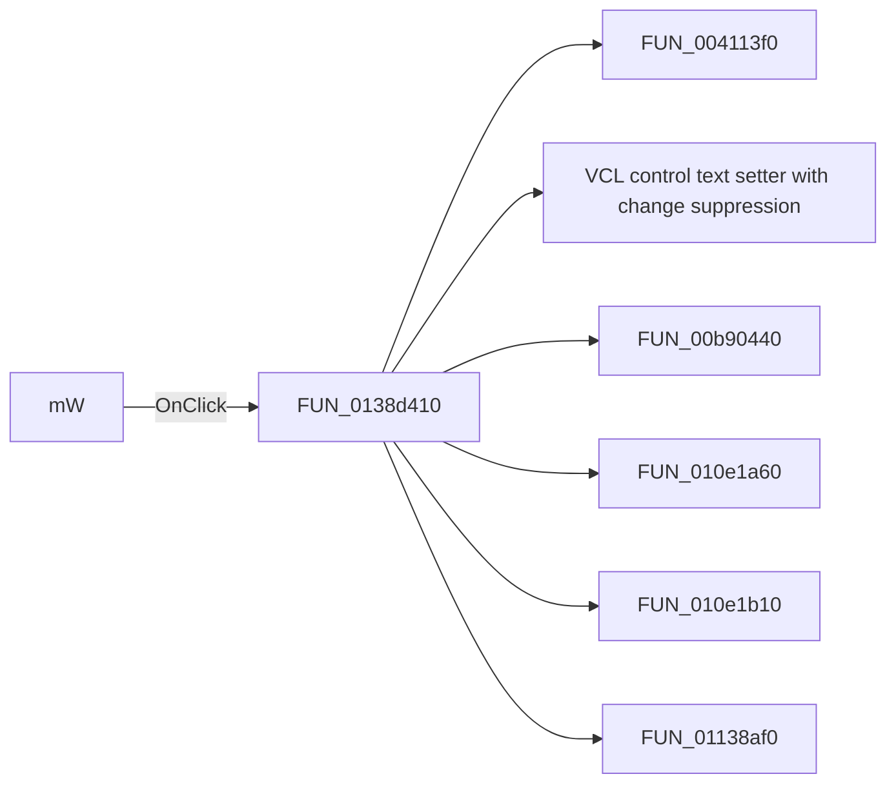

# mW

> Analysis status: Pending individual source review.

## Control

| Property | Recovered value |
| --- | --- |
| Form | SignalAnalyzerWin |
| Component path | SignalAnalyzerWin.Ref_WindowGroupBox.RefUnitSpBtn |
| Control class | TSpeedButton |
| Caption | mW |
| Hint | Not present in the recovered resource. |
| Text | Not present in the recovered resource. |
| Handler name | RefUnitSpBtnClick |
| Handler address | 0138d410 |
| Graph node | `resource:dfm:SignalAnalyzerWin/SignalAnalyzerWin.Ref_WindowGroupBox.RefUnitSpBtn` |
| Handler node | `function:0138d410` |
| Graph layer | UI |

## What happens when clicked

Pending individual analysis. An agent must read the recovered handler source and its relevant callees before it replaces this text.

## Click flow

## Handler evidence

- Source: [DecompiledSources/Tina16/functions/000000000138D410__FUN_0138d410.c](../../../DecompiledSources/Tina16/functions/000000000138D410__FUN_0138d410.c)
- Recovered role: Not present in the recovered resource.
- Current graph summary: Handles 1 Delphi UI event: SignalAnalyzerWin.Ref_WindowGroupBox.RefUnitSpBtn.OnClick.
- Current graph behavior: Not present in the recovered resource.
- Current graph evidence: Not present in the recovered resource.
- Complexity: complex
- Distinct outgoing calls: 6

## Direct calls

- `function:004113f0` — FUN_004113f0
- `function:0064de00` — VCL control text setter with change suppression
- `function:00b90440` — FUN_00b90440
- `function:010e1a60` — FUN_010e1a60
- `function:010e1b10` — FUN_010e1b10
- `function:01138af0` — FUN_01138af0

## Resource evidence

- Kind: Not present in the recovered resource.
- Modal result: Not present in the recovered resource.
- Checked state: Not present in the recovered resource.
- List items: Not present in the recovered resource.
- Image reference: Not present in the recovered resource.
- Extracted glyph: None.

## Nearby label candidates

Nearby labels are layout candidates only. They are not proof of behavior.

- Rank 1: Reference at distance 93.
- Rank 2: Window at distance 109.

## Analysis limits

- Do not infer behavior from the control class, caption, hint, glyph, or nearby label alone.
- Do not replace the pending status until the handler source and relevant call path provide enough evidence.
