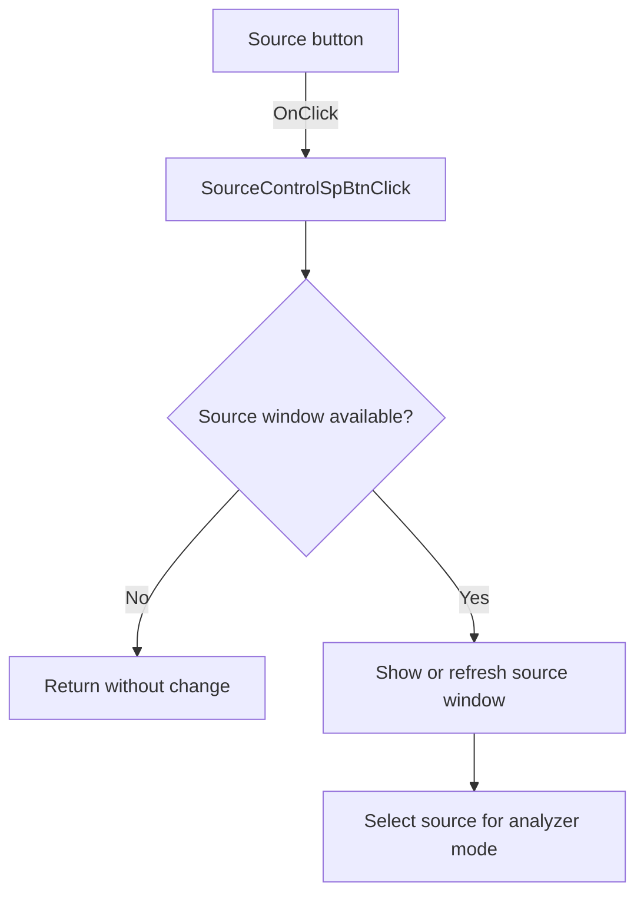

# Source...

> Analysis status: Source reviewed: the click opens or refreshes the analyzer source-control window.

## Control

| Property | Recovered value |
| --- | --- |
| Form | SignalAnalyzerWin |
| Component path | SignalAnalyzerWin.ControlGroupBox.SourceControlSpBtn |
| Control class | TSpeedButton |
| Caption | Source... |
| Hint | Not present in the recovered resource. |
| Text | Not present in the recovered resource. |
| Handler name | SourceControlSpBtnClick |
| Handler address | 0138d2b0 |
| Graph node | `resource:dfm:SignalAnalyzerWin/SignalAnalyzerWin.ControlGroupBox.SourceControlSpBtn` |
| Handler node | `function:0138d2b0` |
| Graph layer | UI |

## What happens when clicked

The handler first calls `FUN_010e1a60` to ensure that a source-control window exists for the active analyzer source. If that operation fails, the handler returns without another action.

On success, it gets the window, verifies its class, shows or refreshes it, and calls `FUN_0113d290`. That callee selects the source entry that matches analyzer mode `4` or `8` by testing the recovered source type values.

## Click flow

## Handler evidence

- Source: [DecompiledSources/Tina16/functions/000000000138D2B0__FUN_0138d2b0.c](../../../DecompiledSources/Tina16/functions/000000000138D2B0__FUN_0138d2b0.c)
- Recovered role: Opens the active analyzer source-control window and selects the matching source.
- Current graph summary: Handles 1 Delphi UI event: SignalAnalyzerWin.ControlGroupBox.SourceControlSpBtn.OnClick.
- Current graph behavior: Not present in the recovered resource.
- Current graph evidence: Not present in the recovered resource.
- Complexity: complex
- Distinct outgoing calls: 5

## Direct calls

- `function:004113f0` — FUN_004113f0
- `function:008059a0` — FUN_008059a0
- `function:010e1a60` — FUN_010e1a60
- `function:010e1b10` — FUN_010e1b10
- `function:0113d290` — FUN_0113d290

## Resource evidence

- Kind: Not present in the recovered resource.
- Modal result: Not present in the recovered resource.
- Checked state: Not present in the recovered resource.
- List items: Not present in the recovered resource.
- Image reference: Not present in the recovered resource.
- Extracted glyph: None.

## Nearby label candidates

Nearby labels are layout candidates only. They are not proof of behavior.

- No same-parent label candidate is available.

## Analysis limits

- The recovered source type numbers do not expose all original Delphi enumeration names.
- Window creation and display errors are handled by the called helpers, not by this handler.
