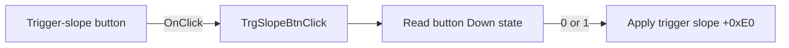

# TrgSlopeBtn

> Analysis status: Source reviewed: the click applies the selected trigger-slope state.

## Control

| Property | Recovered value |
| --- | --- |
| Form | SignalAnalyzerWin |
| Component path | SignalAnalyzerWin.TriggerGroupBox.TrgSlopeBtn |
| Control class | TSpeedButton |
| Caption | Not present in the recovered resource. |
| Hint | Not present in the recovered resource. |
| Text | Not present in the recovered resource. |
| Handler name | TrgSlopeBtnClick |
| Handler address | 0138d0f0 |
| Graph node | `resource:dfm:SignalAnalyzerWin/SignalAnalyzerWin.TriggerGroupBox.TrgSlopeBtn` |
| Handler node | `function:0138d0f0` |
| Graph layer | UI |

## What happens when clicked

The handler reads this speed button's Down state and sends it as value `0` or `1` to analyzer backend virtual slot `+0xE0`.

The extracted waveform glyph shows alternate slope variants and supports the trigger-slope meaning. The handler has no local decision or error path beyond converting the Boolean state to the backend argument.

## Click flow

## Handler evidence

- Source: [DecompiledSources/Tina16/functions/000000000138D0F0__FUN_0138d0f0.c](../../../DecompiledSources/Tina16/functions/000000000138D0F0__FUN_0138d0f0.c)
- Recovered role: Applies the trigger-slope button state to the analyzer backend.
- Current graph summary: Handles 1 Delphi UI event: SignalAnalyzerWin.TriggerGroupBox.TrgSlopeBtn.OnClick.
- Current graph behavior: Not present in the recovered resource.
- Current graph evidence: Not present in the recovered resource.
- Complexity: simple
- Distinct outgoing calls: 0

## Direct calls

- No direct call edge is present in the recovered graph.

## Resource evidence

- Kind: Not present in the recovered resource.
- Modal result: Not present in the recovered resource.
- Checked state: Not present in the recovered resource.
- List items: Not present in the recovered resource.
- Image reference: Not present in the recovered resource.
- Extracted glyph: [`0442_SignalAnalyzerWin_SignalAnalyzerWin_TriggerGroupBox_TrgSlopeBtn_Glyph_Data.png`](../../../glyph/0442_SignalAnalyzerWin_SignalAnalyzerWin_TriggerGroupBox_TrgSlopeBtn_Glyph_Data.png)

## Nearby label candidates

Nearby labels are layout candidates only. They are not proof of behavior.

- Rank 1: Level at distance 97.

## Analysis limits

- The recovered source does not map values `0` and `1` to named rising or falling enumeration values.
- Backend validation and hardware error behavior are not present in this handler.
