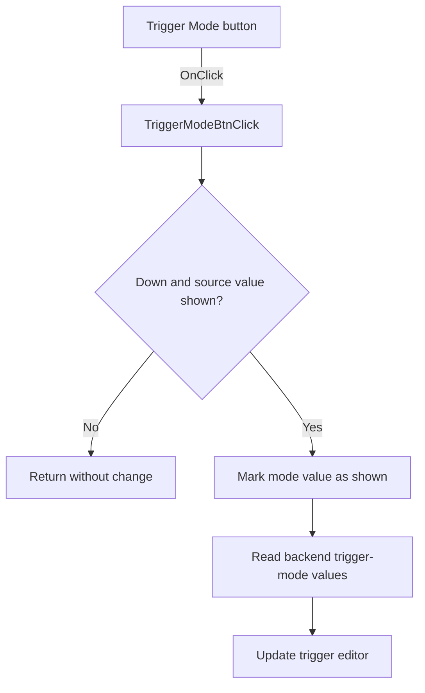

# Mode

> Analysis status: Source reviewed: the click shows the trigger-mode value when the mode button becomes active.

## Control

| Property | Recovered value |
| --- | --- |
| Form | SignalAnalyzerWin |
| Component path | SignalAnalyzerWin.TriggerGroupBox.TriggerModeBtn |
| Control class | TSpeedButton |
| Caption | Mode |
| Hint | Not present in the recovered resource. |
| Text | Not present in the recovered resource. |
| Handler name | TriggerModeBtnClick |
| Handler address | 0138cfd0 |
| Graph node | `resource:dfm:SignalAnalyzerWin/SignalAnalyzerWin.TriggerGroupBox.TriggerModeBtn` |
| Handler node | `function:0138cfd0` |
| Graph layer | UI |

## What happens when clicked

The handler acts only when this button is Down and internal display byte `+0xE47` is false. It then sets that byte to true, gets the trigger-mode value and related setting through backend virtual slots `+0xB0` and `+0xB8`, and writes both values to the trigger editor at form field `+0xD88`.

If the button is not Down, or the display already shows the trigger-mode value, the handler returns without a change. This per-control state branch distinguishes it from the paired Source button.

## Click flow

## Handler evidence

- Source: [DecompiledSources/Tina16/functions/000000000138CFD0__FUN_0138cfd0.c](../../../DecompiledSources/Tina16/functions/000000000138CFD0__FUN_0138cfd0.c)
- Recovered role: Switches the trigger editor to the backend trigger-mode value.
- Current graph summary: Handles 1 Delphi UI event: SignalAnalyzerWin.TriggerGroupBox.TriggerModeBtn.OnClick.
- Current graph behavior: Not present in the recovered resource.
- Current graph evidence: Not present in the recovered resource.
- Complexity: simple
- Distinct outgoing calls: 0

## Direct calls

- No direct call edge is present in the recovered graph.

## Resource evidence

- Kind: Not present in the recovered resource.
- Modal result: Not present in the recovered resource.
- Checked state: Not present in the recovered resource.
- List items: Not present in the recovered resource.
- Image reference: Not present in the recovered resource.
- Extracted glyph: None.

## Nearby label candidates

Nearby labels are layout candidates only. They are not proof of behavior.

- Rank 1: Level at distance 56.

## Analysis limits

- The recovered backend values are not mapped to original Delphi enumeration names.
- The handler updates the editor display; a later edit or commit path is outside this click handler.
