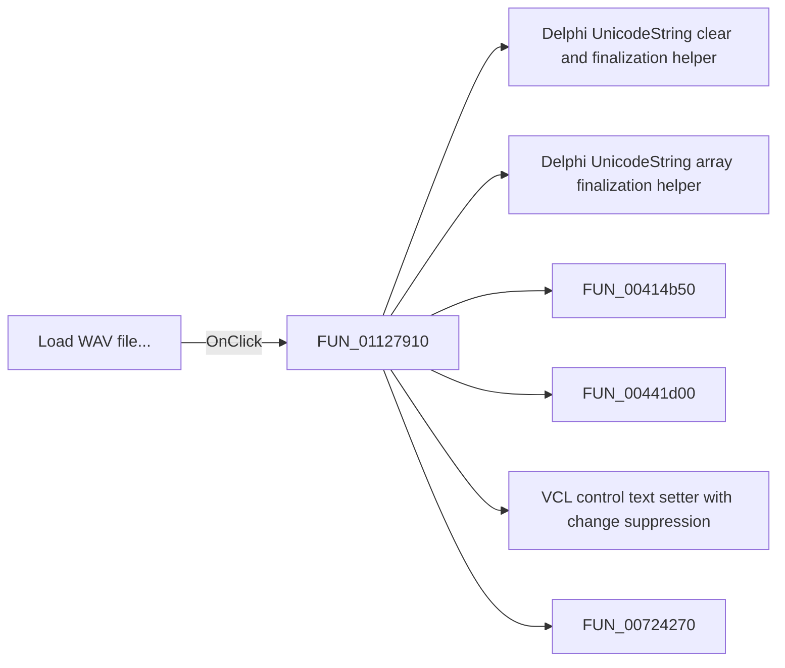

# Load WAV file...

> Analysis status: Pending individual source review.

## Control

| Property | Recovered value |
| --- | --- |
| Form | SignalEditorDlg |
| Component path | SignalEditorDlg.pnlNotebook.pctrlMode.tsSoundInput.btnLoadWAV |
| Control class | TButton |
| Caption | Load WAV file... |
| Hint | Not present in the recovered resource. |
| Text | Not present in the recovered resource. |
| Handler name | btnLoadWAVClick |
| Handler address | 01127910 |
| Graph node | `resource:dfm:SignalEditorDlg/SignalEditorDlg.pnlNotebook.pctrlMode.tsSoundInput.btnLoadWAV` |
| Handler node | `function:01127910` |
| Graph layer | UI |

## What happens when clicked

Pending individual analysis. An agent must read the recovered handler source and its relevant callees before it replaces this text.

## Click flow

## Handler evidence

- Source: [DecompiledSources/Tina16/functions/0000000001127910__FUN_01127910.c](../../../DecompiledSources/Tina16/functions/0000000001127910__FUN_01127910.c)
- Recovered role: Not present in the recovered resource.
- Current graph summary: Handles 1 Delphi UI event: SignalEditorDlg.pnlNotebook.pctrlMode.tsSoundInput.btnLoadWAV.OnClick.
- Current graph behavior: Not present in the recovered resource.
- Current graph evidence: Not present in the recovered resource.
- Complexity: complex
- Distinct outgoing calls: 9

## Direct calls

- `function:00414480` — Delphi UnicodeString clear and finalization helper
- `function:00414560` — Delphi UnicodeString array finalization helper
- `function:00414b50` — FUN_00414b50
- `function:00441d00` — FUN_00441d00
- `function:0064de00` — VCL control text setter with change suppression
- `function:00724270` — FUN_00724270
- `function:01112a40` — FUN_01112a40
- `function:011143a0` — FUN_011143a0
- `function:01c8a3c0` — FUN_01c8a3c0

## Resource evidence

- Kind: Not present in the recovered resource.
- Modal result: Not present in the recovered resource.
- Checked state: Not present in the recovered resource.
- List items: Not present in the recovered resource.
- Image reference: Not present in the recovered resource.
- Extracted glyph: None.

## Nearby label candidates

Nearby labels are layout candidates only. They are not proof of behavior.

- Rank 1: Max voltage at distance 313.

## Analysis limits

- Do not infer behavior from the control class, caption, hint, glyph, or nearby label alone.
- Do not replace the pending status until the handler source and relevant call path provide enough evidence.
