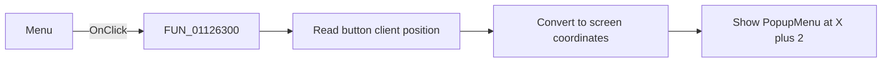

# Menu

> Analysis status: Reviewed against the recovered popup-menu positioning path.

## Control

| Property | Recovered value |
| --- | --- |
| Form | SignalEditorDlg |
| Component path | SignalEditorDlg.pnlNotebook.pctrlMode.tsUserDefined.pnlLocalMenu.btnLocalMenu |
| Control class | TBitBtn |
| Caption | Menu |
| Hint | Not present in the recovered resource. |
| Text | Not present in the recovered resource. |
| Handler name | btnLocalMenuClick |
| Handler address | 01126300 |
| Graph node | `resource:dfm:SignalEditorDlg/SignalEditorDlg.pnlNotebook.pctrlMode.tsUserDefined.pnlLocalMenu.btnLocalMenu` |
| Handler node | `function:01126300` |
| Graph layer | UI |

## What happens when clicked

The handler reads the Menu button's horizontal position, converts the button's
client coordinates to screen coordinates, adds two pixels to the recovered X
coordinate, and invokes the form popup menu at that point. It does not execute a
menu command itself; the selected `TMenuItem` owns the later action. The nearby
ErrorLine label is not an input to this position calculation.

## Click flow

## Handler evidence

- Source: [DecompiledSources/Tina16/functions/0000000001126300__FUN_01126300.c](../../../DecompiledSources/Tina16/functions/0000000001126300__FUN_01126300.c)
- Recovered role: Open the editor popup menu next to the local Menu button.
- Current graph summary: Handles 1 Delphi UI event: SignalEditorDlg.pnlNotebook.pctrlMode.tsUserDefined.pnlLocalMenu.btnLocalMenu.OnClick.
- Current graph behavior: Computes screen coordinates and invokes the popup-menu virtual method.
- Current graph evidence: The handler reads button field `+0x98`, calls the client-to-screen helper, adds `2` to X, and calls the object at form offset `+0x6b8`.
- Complexity: moderate
- Distinct outgoing calls: 2

## Direct calls

- `function:00498310` — FUN_00498310
- `function:0064d1f0` — FUN_0064d1f0

## Resource evidence

- Kind: Not present in the recovered resource.
- Modal result: Not present in the recovered resource.
- Checked state: Not present in the recovered resource.
- List items: Not present in the recovered resource.
- Image reference: Not present in the recovered resource.
- Extracted glyph: None.

## Nearby label candidates

Nearby labels are layout candidates only. They are not proof of behavior.

- Rank 1: Press the Test button to see the signal. at distance 313.

## Analysis limits

- The handler does not choose a menu item or execute a file, test, or options action.
- The nearby ErrorLine label is only a layout candidate.
