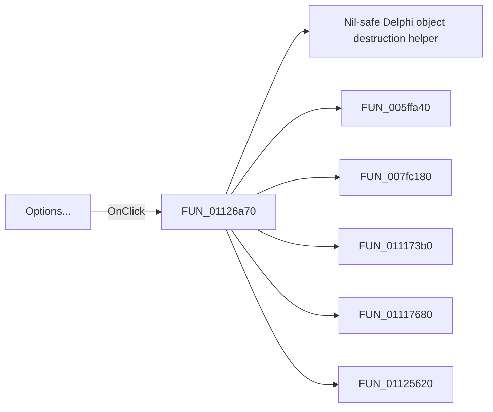

# Options...

> Analysis status: Pending individual source review.

## Control

| Property | Recovered value |
| --- | --- |
| Form | SignalEditorDlg |
| Component path | SignalEditorDlg.pnlStdButtons.btnOptions |
| Control class | TBitBtn |
| Caption | Options... |
| Hint | Not present in the recovered resource. |
| Text | Not present in the recovered resource. |
| Handler name | btnOptionsClick |
| Handler address | 01126a70 |
| Graph node | `resource:dfm:SignalEditorDlg/SignalEditorDlg.pnlStdButtons.btnOptions` |
| Handler node | `function:01126a70` |
| Graph layer | UI |

## What happens when clicked

Pending individual analysis. An agent must read the recovered handler source and its relevant callees before it replaces this text.

## Click flow

## Handler evidence

- Source: [DecompiledSources/Tina16/functions/0000000001126A70__FUN_01126a70.c](../../../DecompiledSources/Tina16/functions/0000000001126A70__FUN_01126a70.c)
- Recovered role: Not present in the recovered resource.
- Current graph summary: Handles 1 Delphi UI event: SignalEditorDlg.pnlStdButtons.btnOptions.OnClick.
- Current graph behavior: Not present in the recovered resource.
- Current graph evidence: Not present in the recovered resource.
- Complexity: complex
- Distinct outgoing calls: 8

## Direct calls

- `function:00410f20` — Nil-safe Delphi object destruction helper
- `function:005ffa40` — FUN_005ffa40
- `function:007fc180` — FUN_007fc180
- `function:011173b0` — FUN_011173b0
- `function:01117680` — FUN_01117680
- `function:01125620` — FUN_01125620
- `function:01126b30` — FUN_01126b30
- `function:01127350` — FUN_01127350

## Resource evidence

- Kind: Not present in the recovered resource.
- Modal result: Not present in the recovered resource.
- Checked state: Not present in the recovered resource.
- List items: Not present in the recovered resource.
- Image reference: Not present in the recovered resource.
- Extracted glyph: None.

## Nearby label candidates

Nearby labels are layout candidates only. They are not proof of behavior.

- No same-parent label candidate is available.

## Analysis limits

- Do not infer behavior from the control class, caption, hint, glyph, or nearby label alone.
- Do not replace the pending status until the handler source and relevant call path provide enough evidence.
