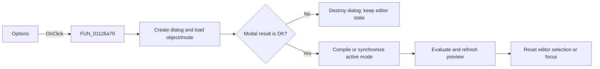

# Options...

> Analysis status: Reviewed against the signal-options dialog and refresh path.

## Control

| Property | Recovered value |
| --- | --- |
| Form | SignalEditorDlg |
| Component path | SignalEditorDlg.pnlStdButtons.btnOptions |
| Control class | TBitBtn |
| Caption | Options... |
| Hint | Not present in the recovered resource. |
| Text | Not present in the recovered resource. |
| Handler name | btnOptionsClick |
| Handler address | 01126a70 |
| Graph node | `resource:dfm:SignalEditorDlg/SignalEditorDlg.pnlStdButtons.btnOptions` |
| Handler node | `function:01126a70` |
| Graph layer | UI |

## What happens when clicked

The handler constructs a temporary signal-options dialog, supplies the current
compiled signal object and active mode, and shows it modally. It always destroys
the temporary dialog after the modal call. Cancel performs no compile or preview
refresh. If the result is OK (`1`), the handler compiles user-defined mode `8` or
synchronizes the other editable mode, evaluates the active signal through
`FUN_01125620`, and resets the editor selection or focus state.

## Click flow

## Handler evidence

- Source: [DecompiledSources/Tina16/functions/0000000001126A70__FUN_01126a70.c](../../../DecompiledSources/Tina16/functions/0000000001126A70__FUN_01126a70.c)
- Recovered role: Edit signal options and refresh the accepted result.
- Current graph summary: Handles 1 Delphi UI event: SignalEditorDlg.pnlStdButtons.btnOptions.OnClick.
- Current graph behavior: Shows a mode-aware options dialog and refreshes only after modal result `1`.
- Current graph evidence: The source constructs the dialog, calls its setup helpers, checks result `1`, and conditionally calls compile/sync and test helpers.
- Complexity: complex
- Distinct outgoing calls: 8

## Direct calls

- `function:00410f20` — Nil-safe Delphi object destruction helper
- `function:005ffa40` — FUN_005ffa40
- `function:007fc180` — FUN_007fc180
- `function:011173b0` — FUN_011173b0
- `function:01117680` — FUN_01117680
- `function:01125620` — FUN_01125620
- `function:01126b30` — FUN_01126b30
- `function:01127350` — FUN_01127350

## Resource evidence

- Kind: Not present in the recovered resource.
- Modal result: Not present in the recovered resource.
- Checked state: Not present in the recovered resource.
- List items: Not present in the recovered resource.
- Image reference: Not present in the recovered resource.
- Extracted glyph: None.

## Nearby label candidates

Nearby labels are layout candidates only. They are not proof of behavior.

- No same-parent label candidate is available.

## Analysis limits

- The individual option fields are not named in the recovered source.
- Cancel is a verified no-op for compile and preview refresh.
