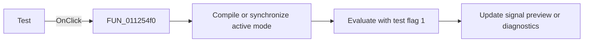

# &Test

> Analysis status: Reviewed against the shared compile-and-test path.

## Control

| Property | Recovered value |
| --- | --- |
| Form | SignalEditorDlg |
| Component path | SignalEditorDlg.pnlNotebook.pctrlMode.tsUserDefined.pnlLocalMenu.btnTest |
| Control class | TBitBtn |
| Caption | &Test |
| Hint | Not present in the recovered resource. |
| Text | Not present in the recovered resource. |
| Handler name | btnTestClick |
| Handler address | 011254f0 |
| Graph node | `resource:dfm:SignalEditorDlg/SignalEditorDlg.pnlNotebook.pctrlMode.tsUserDefined.pnlLocalMenu.btnTest` |
| Handler node | `function:011254f0` |
| Graph layer | UI |

## What happens when clicked

The local Test button uses the same two-step path as the popup Test item. It first
calls `FUN_011254a0` to compile user-defined mode `8` or synchronize the
piecewise-linear editor. It then calls `FUN_01125620`, which evaluates the active
signal with test flag `1` and updates the preview or diagnostics. The nearby
ErrorLine text describes this control, but the recovered call order independently
proves the test behavior. This wrapper has no separate error branch.

## Click flow

## Handler evidence

- Source: [DecompiledSources/Tina16/functions/00000000011254F0__FUN_011254f0.c](../../../DecompiledSources/Tina16/functions/00000000011254F0__FUN_011254f0.c)
- Recovered role: Compile and test the active signal from the local editor panel.
- Current graph summary: Handles 1 Delphi UI event: SignalEditorDlg.pnlNotebook.pctrlMode.tsUserDefined.pnlLocalMenu.btnTest.OnClick.
- Current graph behavior: Calls the shared syntax handler and test wrapper in a fixed order.
- Current graph evidence: The body contains exactly `FUN_011254a0(param_1)` followed by `FUN_01125620(param_1)`; the nearby label says to press Test to see the signal.
- Complexity: moderate
- Distinct outgoing calls: 2

## Direct calls

- `function:011254a0` — Handles 1 Delphi UI event: SignalEditorDlg.PopupMenu.pmiCompile.OnClick.
- `function:01125620` — FUN_01125620

## Resource evidence

- Kind: Not present in the recovered resource.
- Modal result: Not present in the recovered resource.
- Checked state: Not present in the recovered resource.
- List items: Not present in the recovered resource.
- Image reference: Not present in the recovered resource.
- Extracted glyph: None.

## Nearby label candidates

Nearby labels are layout candidates only. They are not proof of behavior.

- Rank 1: Press the Test button to see the signal. at distance 240.

## Analysis limits

- The wrapper does not branch on the compile result; the called evaluation path performs its own validity checks.
- The preview rendering format is outside this function.
