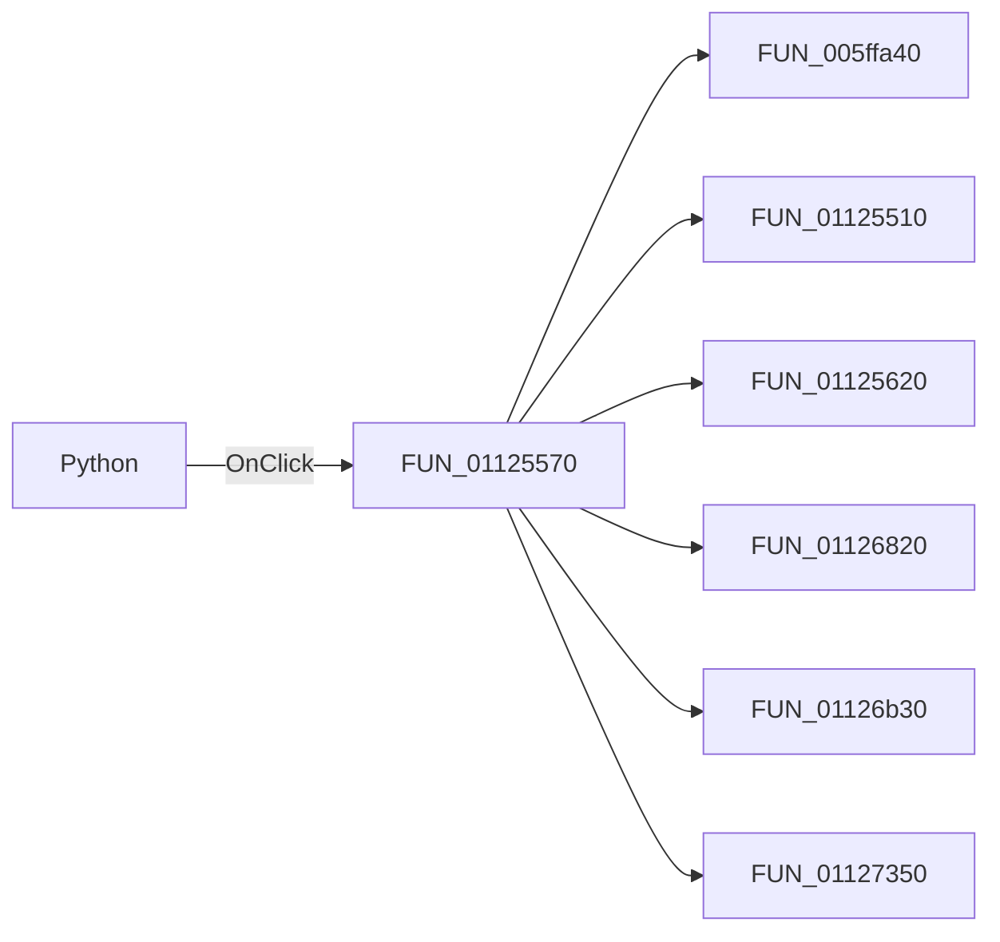

# Python

> Analysis status: Pending individual source review.

## Control

| Property | Recovered value |
| --- | --- |
| Form | SignalEditorDlg |
| Component path | SignalEditorDlg.pnlStdButtons.cbPython |
| Control class | TCheckBox |
| Caption | Python |
| Hint | Not present in the recovered resource. |
| Text | Not present in the recovered resource. |
| Handler name | cbPythonClick |
| Handler address | 01125570 |
| Graph node | `resource:dfm:SignalEditorDlg/SignalEditorDlg.pnlStdButtons.cbPython` |
| Handler node | `function:01125570` |
| Graph layer | UI |

## What happens when clicked

Pending individual analysis. An agent must read the recovered handler source and its relevant callees before it replaces this text.

## Click flow

## Handler evidence

- Source: [DecompiledSources/Tina16/functions/0000000001125570__FUN_01125570.c](../../../DecompiledSources/Tina16/functions/0000000001125570__FUN_01125570.c)
- Recovered role: Not present in the recovered resource.
- Current graph summary: Handles 1 Delphi UI event: SignalEditorDlg.pnlStdButtons.cbPython.OnClick.
- Current graph behavior: Not present in the recovered resource.
- Current graph evidence: Not present in the recovered resource.
- Complexity: complex
- Distinct outgoing calls: 6

## Direct calls

- `function:005ffa40` — FUN_005ffa40
- `function:01125510` — FUN_01125510
- `function:01125620` — FUN_01125620
- `function:01126820` — FUN_01126820
- `function:01126b30` — FUN_01126b30
- `function:01127350` — FUN_01127350

## Resource evidence

- Kind: Not present in the recovered resource.
- Modal result: Not present in the recovered resource.
- Checked state: Not present in the recovered resource.
- List items: Not present in the recovered resource.
- Image reference: Not present in the recovered resource.
- Extracted glyph: None.

## Nearby label candidates

Nearby labels are layout candidates only. They are not proof of behavior.

- No same-parent label candidate is available.

## Analysis limits

- Do not infer behavior from the control class, caption, hint, glyph, or nearby label alone.
- Do not replace the pending status until the handler source and relevant call path provide enough evidence.
