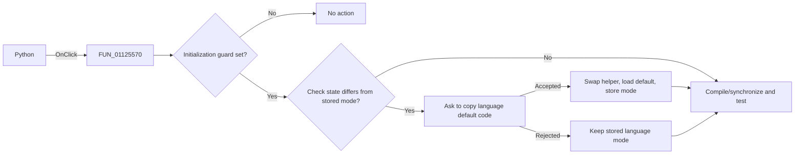

# Python

> Analysis status: Reviewed against the guarded language-switch workflow.

## Control

| Property | Recovered value |
| --- | --- |
| Form | SignalEditorDlg |
| Component path | SignalEditorDlg.pnlStdButtons.cbPython |
| Control class | TCheckBox |
| Caption | Python |
| Hint | Not present in the recovered resource. |
| Text | Not present in the recovered resource. |
| Handler name | cbPythonClick |
| Handler address | 01125570 |
| Graph node | `resource:dfm:SignalEditorDlg/SignalEditorDlg.pnlStdButtons.cbPython` |
| Handler node | `function:01125570` |
| Graph layer | UI |

## What happens when clicked

The handler runs only when initialization guard `+0xb4e` is set. It reads the
Python check state and compares it with stored language mode `+0x8f8`. When the
mode changes, `FUN_01126820` selects `DEFAULT.EXC` for the non-Python path or
`default_py.exc` for Python and asks whether to copy that default code into the
editor. Cancel or No leaves the stored language mode unchanged. Acceptance swaps
the editor's language-specific helper, loads the selected default code, clears
the modified state, and stores the new mode. The handler then compiles or
synchronizes the active signal, runs the test refresh, and resets editor focus.
If the initialization guard is clear, the click is a no-op.

## Click flow

## Handler evidence

- Source: [DecompiledSources/Tina16/functions/0000000001125570__FUN_01125570.c](../../../DecompiledSources/Tina16/functions/0000000001125570__FUN_01125570.c)
- Recovered role: Switch the user-defined editor between Python and non-Python defaults.
- Current graph summary: Handles 1 Delphi UI event: SignalEditorDlg.pnlStdButtons.cbPython.OnClick.
- Current graph behavior: Guards initialization, confirms a language change, conditionally swaps editor state, then refreshes compilation and preview.
- Current graph evidence: The handler reads the check state through `FUN_01125510`, compares `+0x8f8`, calls `FUN_01126820`, and stores the new value only when that helper succeeds.
- Complexity: complex
- Distinct outgoing calls: 6

## Direct calls

- `function:005ffa40` — FUN_005ffa40
- `function:01125510` — FUN_01125510
- `function:01125620` — FUN_01125620
- `function:01126820` — FUN_01126820
- `function:01126b30` — FUN_01126b30
- `function:01127350` — FUN_01127350

## Resource evidence

- Kind: Not present in the recovered resource.
- Modal result: Not present in the recovered resource.
- Checked state: Not present in the recovered resource.
- List items: Not present in the recovered resource.
- Image reference: Not present in the recovered resource.
- Extracted glyph: None.

## Nearby label candidates

Nearby labels are layout candidates only. They are not proof of behavior.

- No same-parent label candidate is available.

## Analysis limits

- The confirmation helper treats both Cancel and No as rejection; the stored language mode stays unchanged.
- Compiler and preview errors are handled in the called paths.
