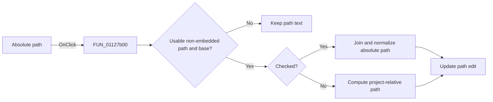

# Absolute path

> Analysis status: Reviewed against the recovered absolute/relative path conversion.

## Control

| Property | Recovered value |
| --- | --- |
| Form | SignalEditorDlg |
| Component path | SignalEditorDlg.pnlNotebook.pctrlMode.tsSoundInput.chkbxAbsolutePath |
| Control class | TCheckBox |
| Caption | Absolute path |
| Hint | If checked WAV file is referenced with an absolute path |
| Text | Not present in the recovered resource. |
| Handler name | chkbxAbsolutePathClick |
| Handler address | 01127b00 |
| Graph node | `resource:dfm:SignalEditorDlg/SignalEditorDlg.pnlNotebook.pctrlMode.tsSoundInput.chkbxAbsolutePath` |
| Handler node | `function:01127b00` |
| Graph layer | UI |

## What happens when clicked

The handler converts the current WAV path in place. It does nothing during the
guarded form state, for empty text, for `<embedded>`, or when the project base
path cannot be derived. If the check box is checked, it joins the project
directory with the current relative path and normalizes it to an absolute path.
If it is unchecked, it computes a relative path from the project location to the
current WAV file. It then writes the result back to the path edit. It does not
reload the audio file in this handler.

## Click flow

## Handler evidence

- Source: [DecompiledSources/Tina16/functions/0000000001127B00__FUN_01127b00.c](../../../DecompiledSources/Tina16/functions/0000000001127B00__FUN_01127b00.c)
- Recovered role: Convert the WAV reference between absolute and project-relative form.
- Current graph summary: Handles 1 Delphi UI event: SignalEditorDlg.pnlNotebook.pctrlMode.tsSoundInput.chkbxAbsolutePath.OnClick.
- Current graph behavior: Guards unusable values, branches on check state, and rewrites the WAV path edit.
- Current graph evidence: The handler compares against `<embedded>`, queries the check box, and uses separate relative-path and join/normalize call paths.
- Complexity: complex
- Distinct outgoing calls: 12

## Direct calls

- `function:00414480` — Delphi UnicodeString clear and finalization helper
- `function:00414560` — Delphi UnicodeString array finalization helper
- `function:00414b50` — FUN_00414b50
- `function:00416ad0` — FUN_00416ad0
- `function:0043e420` — FUN_0043e420
- `function:00441640` — FUN_00441640
- `function:00441820` — FUN_00441820
- `function:00441b80` — FUN_00441b80
- `function:00441d00` — FUN_00441d00
- `function:0064dd90` — VCL control Unicode text reader
- `function:0064de00` — VCL control text setter with change suppression
- `function:01c8a3c0` — FUN_01c8a3c0

## Resource evidence

- Kind: Not present in the recovered resource.
- Modal result: Not present in the recovered resource.
- Checked state: Not present in the recovered resource.
- List items: Not present in the recovered resource.
- Image reference: Not present in the recovered resource.
- Extracted glyph: None.

## Nearby label candidates

Nearby labels are layout candidates only. They are not proof of behavior.

- Rank 1: Max voltage at distance 211.

## Analysis limits

- The recovered path helpers do not expose filesystem-access errors in this handler.
- The nearby Max voltage label is unrelated layout evidence.
