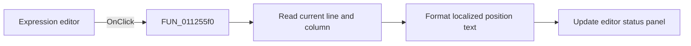

# Edit

> Analysis status: Reviewed against the editor-position status updater.

## Control

| Property | Recovered value |
| --- | --- |
| Form | SignalEditorDlg |
| Component path | SignalEditorDlg.pnlNotebook.pctrlMode.tsUserDefined.Edit |
| Control class | TSynMemo |
| Caption | Not present in the recovered resource. |
| Hint | Not present in the recovered resource. |
| Text | Not present in the recovered resource. |
| Handler name | EditClick |
| Handler address | 011255f0 |
| Graph node | `resource:dfm:SignalEditorDlg/SignalEditorDlg.pnlNotebook.pctrlMode.tsUserDefined.Edit` |
| Handler node | `function:011255f0` |
| Graph layer | UI |

## What happens when clicked

The click delegates to `FUN_01126110`. That helper reads the editor's current line
and column values, stores them at form offsets `+0xb50` and `+0xb54`, formats them
with localized strings `0x3e5` and `0x3e6`, and writes the result to the local
status panel. It does not change the document text, compile the expression, or
show the popup menu. The handler has no conditional error path.

## Click flow

## Handler evidence

- Source: [DecompiledSources/Tina16/functions/00000000011255F0__FUN_011255f0.c](../../../DecompiledSources/Tina16/functions/00000000011255F0__FUN_011255f0.c)
- Recovered role: Refresh the expression editor line-and-column status.
- Current graph summary: Handles 1 Delphi UI event: SignalEditorDlg.pnlNotebook.pctrlMode.tsUserDefined.Edit.OnClick.
- Current graph behavior: Delegates to the caret-position status formatter.
- Current graph evidence: `FUN_011255f0` contains one call to `FUN_01126110`; the callee reads two editor coordinates and writes one control caption.
- Complexity: simple
- Distinct outgoing calls: 1

## Direct calls

- `function:01126110` — FUN_01126110

## Resource evidence

- Kind: Not present in the recovered resource.
- Modal result: Not present in the recovered resource.
- Checked state: Not present in the recovered resource.
- List items: Not present in the recovered resource.
- Image reference: Not present in the recovered resource.
- Extracted glyph: None.

## Nearby label candidates

Nearby labels are layout candidates only. They are not proof of behavior.

- No same-parent label candidate is available.

## Analysis limits

- The localized labels behind resource IDs `0x3e5` and `0x3e6` are not named in the function.
- No document mutation or compile call is present.
