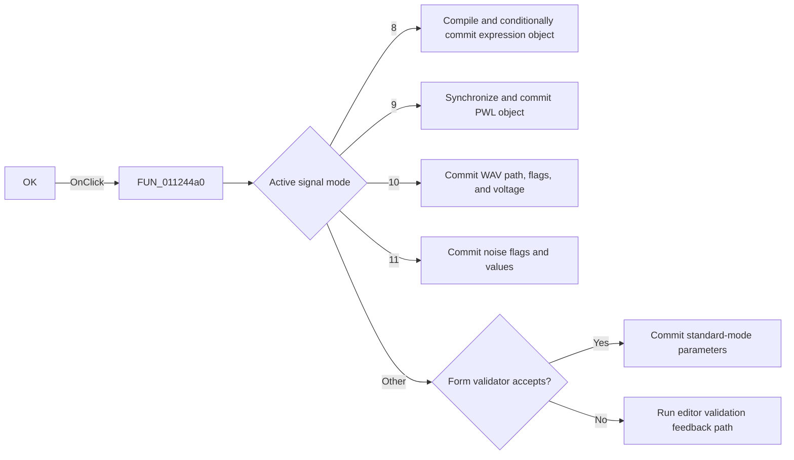

# OKBtn

> Analysis status: Reviewed against the complete mode-specific commit path.

## Control

| Property | Recovered value |
| --- | --- |
| Form | SignalEditorDlg |
| Component path | SignalEditorDlg.pnlStdButtons.OKBtn |
| Control class | TBitBtn |
| Caption | Not present in the recovered resource. |
| Hint | Not present in the recovered resource. |
| Text | Not present in the recovered resource. |
| Handler name | OKBtnClick |
| Handler address | 011244a0 |
| Graph node | `resource:dfm:SignalEditorDlg/SignalEditorDlg.pnlStdButtons.OKBtn` |
| Handler node | `function:011244a0` |
| Graph layer | UI |

## What happens when clicked

The handler commits the active signal editor into the destination record at form
offset `+0x900`. It first detects a mode change and updates the destination
selection. User-defined mode `8` runs the compiler and commits its compiled object
and metadata only through the recovered `+0xb70` result gate. Piecewise-linear
mode `9` synchronizes text and transfers its object state. WAV mode `10` stores
the referenced or embedded path, channel/repeat/embed flags, and maximum-voltage
value. Noise mode `11` copies its two check states and numeric values. Standard
modes copy their parameter arrays after the form-level validator accepts them.
Rejected validation calls the editor feedback path instead of overwriting the
destination. The `bkOK` resource confirms this is the dialog acceptance control,
but no explicit `ModalResult` assignment is present in the recovered handler.

## Click flow

## Handler evidence

- Source: [DecompiledSources/Tina16/functions/00000000011244A0__FUN_011244a0.c](../../../DecompiledSources/Tina16/functions/00000000011244A0__FUN_011244a0.c)
- Recovered role: Validate and commit the active signal definition to the destination record.
- Current graph summary: Handles 1 Delphi UI event: SignalEditorDlg.pnlStdButtons.OKBtn.OnClick.
- Current graph behavior: Uses mode-specific branches to replace owned destination data only after the applicable validation gate.
- Current graph evidence: The handler branches on modes `8`, `9`, `10`, and `11`, copies values into the object at `+0x900`, and uses a separate validator for standard modes.
- Complexity: complex
- Distinct outgoing calls: 33

## Direct calls

- `function:00409570` — FUN_00409570
- `function:004095f0` — FUN_004095f0
- `function:00409a70` — FUN_00409a70
- `function:00410e60` — FUN_00410e60
- `function:00410f20` — Nil-safe Delphi object destruction helper
- `function:004144d0` — FUN_004144d0
- `function:00414560` — Delphi UnicodeString array finalization helper
- `function:00414b50` — FUN_00414b50
- `function:00414ce0` — FUN_00414ce0
- `function:00415430` — FUN_00415430
- `function:00416740` — FUN_00416740
- `function:004167d0` — FUN_004167d0
- `function:00416ad0` — FUN_00416ad0
- `function:0043e420` — FUN_0043e420
- `function:00441640` — FUN_00441640
- `function:00441b80` — FUN_00441b80
- `function:00442450` — FUN_00442450
- `function:004425e0` — FUN_004425e0
- `function:00442bd0` — FUN_00442bd0
- `function:00442c30` — FUN_00442c30
- `function:004b6930` — FUN_004b6930
- `function:004b9ec0` — FUN_004b9ec0
- `function:004b9f40` — FUN_004b9f40
- `function:0064dd90` — VCL control Unicode text reader
- `function:00b0a890` — FUN_00b0a890
- `function:00b0a960` — FUN_00b0a960
- `function:00b90090` — FUN_00b90090
- `function:010d75a0` — FUN_010d75a0
- `function:01126b30` — FUN_01126b30
- `function:016da8e0` — FUN_016da8e0
- `function:019a4600` — FUN_019a4600
- `function:01c8a3c0` — FUN_01c8a3c0
- `function:01d08870` — FUN_01d08870

## Resource evidence

- Kind: bkOK
- Modal result: Not present in the recovered resource.
- Checked state: Not present in the recovered resource.
- List items: Not present in the recovered resource.
- Image reference: Not present in the recovered resource.
- Extracted glyph: None.

## Nearby label candidates

Nearby labels are layout candidates only. They are not proof of behavior.

- No same-parent label candidate is available.

## Analysis limits

- The recovered source does not name the `+0xb70` flag, every copied field, or the downstream dialog-close mechanism.
- The handler proves rejected standard validation avoids the commit block and invokes feedback instead.
