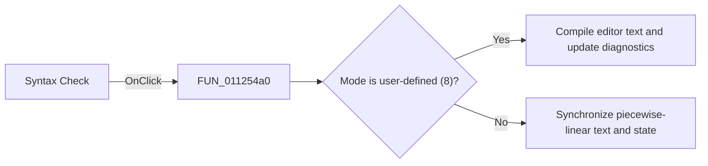

# S&yntax Check

> Analysis status: Reviewed against the recovered handler and its mode-specific callees.

## Control

| Property | Recovered value |
| --- | --- |
| Form | SignalEditorDlg |
| Component path | SignalEditorDlg.PopupMenu.pmiCompile |
| Control class | TMenuItem |
| Caption | S&yntax Check |
| Hint | Not present in the recovered resource. |
| Text | Not present in the recovered resource. |
| Handler name | pmiCompileClick |
| Handler address | 011254a0 |
| Graph node | `resource:dfm:SignalEditorDlg/SignalEditorDlg.PopupMenu.pmiCompile` |
| Handler node | `function:011254a0` |
| Graph layer | UI |

## What happens when clicked

The handler reads the active signal-mode value at form offset `+0xb48`. Mode `8`
uses `FUN_01126b30`, which copies the editor text into a compiler object, runs the
user-defined expression compiler, stores its result flag at `+0xb70`, and writes
diagnostic text and color to the error display. Other modes use `FUN_01127350`,
which copies the piecewise-linear editor text into its backing object, updates a
state byte, and releases a prior result object. The handler does not save a file
or close the dialog. The exact meaning of the compiler result flag is not named
in the recovered source.

## Click flow

## Handler evidence

- Source: [DecompiledSources/Tina16/functions/00000000011254A0__FUN_011254a0.c](../../../DecompiledSources/Tina16/functions/00000000011254A0__FUN_011254a0.c)
- Recovered role: Dispatch syntax checking for the active editable signal mode.
- Current graph summary: Handles 1 Delphi UI event: SignalEditorDlg.PopupMenu.pmiCompile.OnClick.
- Current graph behavior: Selects the user-defined compiler or piecewise-linear synchronization path from mode offset `+0xb48`.
- Current graph evidence: The handler branches on literal mode `8` and calls `FUN_01126b30` or `FUN_01127350`.
- Complexity: moderate
- Distinct outgoing calls: 2

## Direct calls

- `function:01126b30` — FUN_01126b30
- `function:01127350` — FUN_01127350

## Resource evidence

- Kind: Not present in the recovered resource.
- Modal result: Not present in the recovered resource.
- Checked state: Not present in the recovered resource.
- List items: Not present in the recovered resource.
- Image reference: Not present in the recovered resource.
- Extracted glyph: None.

## Nearby label candidates

Nearby labels are layout candidates only. They are not proof of behavior.

- No same-parent label candidate is available.

## Analysis limits

- The source proves mode-based compilation or synchronization, but it does not name the compiler result flag or every diagnostic message.
- No file write or dialog-close call is present in this handler.
