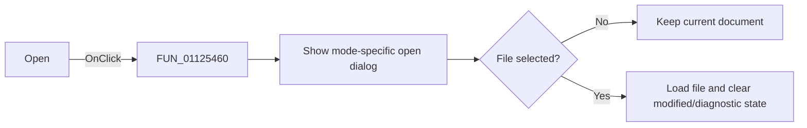

# &Open...

> Analysis status: Reviewed against the recovered handler and file-load path.

## Control

| Property | Recovered value |
| --- | --- |
| Form | SignalEditorDlg |
| Component path | SignalEditorDlg.PopupMenu.pmiLoad |
| Control class | TMenuItem |
| Caption | &Open... |
| Hint | Not present in the recovered resource. |
| Text | Not present in the recovered resource. |
| Handler name | pmiLoadClick |
| Handler address | 01125460 |
| Graph node | `resource:dfm:SignalEditorDlg/SignalEditorDlg.PopupMenu.pmiLoad` |
| Handler node | `function:01125460` |
| Graph layer | UI |

## What happens when clicked

The click delegates to `FUN_01125a60`. That function selects the user-defined
open dialog for mode `8`; all other editable modes use the piecewise-linear open
dialog. If the user cancels the dialog, the function only releases temporary
strings. If a file is selected, it stores the selected path in the corresponding
form field, loads the file into the active editor or backing object, clears the
editor modified state, and clears the shared diagnostic-path field at `+0xb68`.
The recovered source has no separate error dialog in this path.

## Click flow

## Handler evidence

- Source: [DecompiledSources/Tina16/functions/0000000001125460__FUN_01125460.c](../../../DecompiledSources/Tina16/functions/0000000001125460__FUN_01125460.c)
- Recovered role: Open a user-defined or piecewise-linear signal file.
- Current graph summary: Handles 1 Delphi UI event: SignalEditorDlg.PopupMenu.pmiLoad.OnClick.
- Current graph behavior: Delegates to the mode-specific open-dialog and load path.
- Current graph evidence: `FUN_01125460` is a one-call wrapper around `FUN_01125a60`; the callee branches on mode `8` and checks the dialog result.
- Complexity: simple
- Distinct outgoing calls: 1

## Direct calls

- `function:01125a60` — FUN_01125a60

## Resource evidence

- Kind: Not present in the recovered resource.
- Modal result: Not present in the recovered resource.
- Checked state: Not present in the recovered resource.
- List items: Not present in the recovered resource.
- Image reference: Not present in the recovered resource.
- Extracted glyph: None.

## Nearby label candidates

Nearby labels are layout candidates only. They are not proof of behavior.

- No same-parent label candidate is available.

## Analysis limits

- The open-dialog filters and the loader's internal parse errors are not named in the recovered source.
- Cancel is a no-op for the current editor and stored file name.
