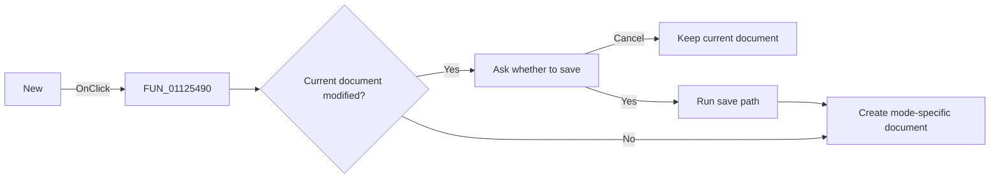

# &New

> Analysis status: Reviewed against the recovered new-document path.

## Control

| Property | Recovered value |
| --- | --- |
| Form | SignalEditorDlg |
| Component path | SignalEditorDlg.PopupMenu.pmiNew |
| Control class | TMenuItem |
| Caption | &New |
| Hint | Not present in the recovered resource. |
| Text | Not present in the recovered resource. |
| Handler name | pmiNewClick |
| Handler address | 01125490 |
| Graph node | `resource:dfm:SignalEditorDlg/SignalEditorDlg.PopupMenu.pmiNew` |
| Handler node | `function:01125490` |
| Graph layer | UI |

## What happens when clicked

The click delegates to `FUN_01125630`. When the editor is modified, that function
asks whether to save the current document. A Yes result calls the normal save
path; Cancel stops the operation. Otherwise it creates a fresh backing object for
the active mode. User-defined mode `8` receives the name `noname.exc` and, when
available, loads `DEFAULT.EXC`. The piecewise-linear path receives
`noname.pwl` and clears its editor object. Both successful paths clear the
modified state, refresh the editor status text, and run the appropriate
compile/synchronization helper.

## Click flow

## Handler evidence

- Source: [DecompiledSources/Tina16/functions/0000000001125490__FUN_01125490.c](../../../DecompiledSources/Tina16/functions/0000000001125490__FUN_01125490.c)
- Recovered role: Start a new editable signal document with save confirmation.
- Current graph summary: Handles 1 Delphi UI event: SignalEditorDlg.PopupMenu.pmiNew.OnClick.
- Current graph behavior: Delegates to a modified-document prompt and mode-specific reset path.
- Current graph evidence: The wrapper calls `FUN_01125630`, which checks the modified byte, handles Yes and Cancel results, and writes `noname.exc` or `noname.pwl`.
- Complexity: simple
- Distinct outgoing calls: 1

## Direct calls

- `function:01125630` — FUN_01125630

## Resource evidence

- Kind: Not present in the recovered resource.
- Modal result: Not present in the recovered resource.
- Checked state: Not present in the recovered resource.
- List items: Not present in the recovered resource.
- Image reference: Not present in the recovered resource.
- Extracted glyph: None.

## Nearby label candidates

Nearby labels are layout candidates only. They are not proof of behavior.

- No same-parent label candidate is available.

## Analysis limits

- A failed save does not return a separate status to this function in the recovered signature.
- The exact localized confirmation text is assembled by helper calls and is not fully recovered.
