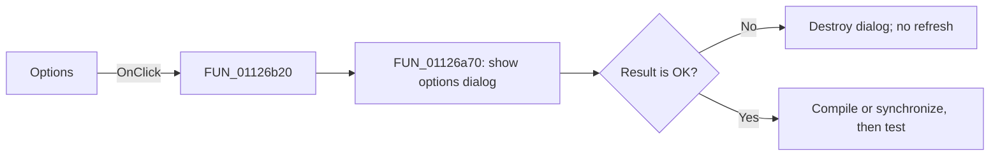

# &Options...

> Analysis status: Reviewed against the shared options-dialog handler.

## Control

| Property | Recovered value |
| --- | --- |
| Form | SignalEditorDlg |
| Component path | SignalEditorDlg.PopupMenu.pmiOptions |
| Control class | TMenuItem |
| Caption | &Options... |
| Hint | Not present in the recovered resource. |
| Text | Not present in the recovered resource. |
| Handler name | pmiOptionsClick |
| Handler address | 01126b20 |
| Graph node | `resource:dfm:SignalEditorDlg/SignalEditorDlg.PopupMenu.pmiOptions` |
| Handler node | `function:01126b20` |
| Graph layer | UI |

## What happens when clicked

This menu item is a one-call wrapper around the same options path as the visible
Options button. `FUN_01126a70` constructs the signal-options dialog, passes it the
current compiled object and signal mode, and shows it modally. Cancel destroys the
temporary dialog without changing the editor. An OK result recompiles or
synchronizes the active editable mode, runs the test/evaluation refresh, and
resets the editor selection or focus state.

## Click flow

## Handler evidence

- Source: [DecompiledSources/Tina16/functions/0000000001126B20__FUN_01126b20.c](../../../DecompiledSources/Tina16/functions/0000000001126B20__FUN_01126b20.c)
- Recovered role: Open the shared signal-options workflow from the popup menu.
- Current graph summary: Handles 1 Delphi UI event: SignalEditorDlg.PopupMenu.pmiOptions.OnClick.
- Current graph behavior: Delegates directly to `FUN_01126a70`.
- Current graph evidence: The wrapper contains one call; the callee checks modal result `1` before all editor refresh work.
- Complexity: simple
- Distinct outgoing calls: 1

## Direct calls

- `function:01126a70` — Handles 1 Delphi UI event: SignalEditorDlg.pnlStdButtons.btnOptions.OnClick.

## Resource evidence

- Kind: Not present in the recovered resource.
- Modal result: Not present in the recovered resource.
- Checked state: Not present in the recovered resource.
- List items: Not present in the recovered resource.
- Image reference: Not present in the recovered resource.
- Extracted glyph: None.

## Nearby label candidates

Nearby labels are layout candidates only. They are not proof of behavior.

- No same-parent label candidate is available.

## Analysis limits

- The recovered source does not name every option field in the temporary dialog.
- Cancel is a verified no-op for the editor refresh path.
