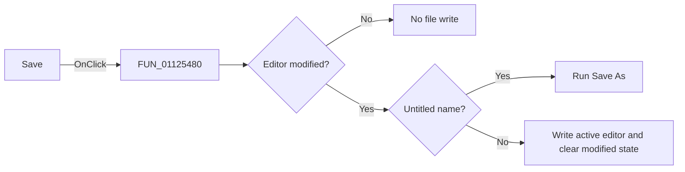

# &Save

> Analysis status: Reviewed against the recovered save path.

## Control

| Property | Recovered value |
| --- | --- |
| Form | SignalEditorDlg |
| Component path | SignalEditorDlg.PopupMenu.pmiSave |
| Control class | TMenuItem |
| Caption | &Save |
| Hint | Not present in the recovered resource. |
| Text | Not present in the recovered resource. |
| Handler name | pmiSaveClick |
| Handler address | 01125480 |
| Graph node | `resource:dfm:SignalEditorDlg/SignalEditorDlg.PopupMenu.pmiSave` |
| Handler node | `function:01125480` |
| Graph layer | UI |

## What happens when clicked

The click delegates to `FUN_01125cd0`. If the editor is not modified, it returns
without writing. For user-defined mode `8` and piecewise-linear mode `9`, an
untitled name (`noname.exc` or `noname.pwl`) redirects to Save As. Otherwise the
active editor object writes to its stored file name and the handler clears the
modified state. The recovered wrapper has no direct success message or exception
branch.

## Click flow

## Handler evidence

- Source: [DecompiledSources/Tina16/functions/0000000001125480__FUN_01125480.c](../../../DecompiledSources/Tina16/functions/0000000001125480__FUN_01125480.c)
- Recovered role: Save the active editable signal document.
- Current graph summary: Handles 1 Delphi UI event: SignalEditorDlg.PopupMenu.pmiSave.OnClick.
- Current graph behavior: Delegates to a modified-state and file-name-aware save routine.
- Current graph evidence: `FUN_01125480` wraps `FUN_01125cd0`; the callee compares the mode-specific name with `noname.exc` or `noname.pwl`.
- Complexity: simple
- Distinct outgoing calls: 1

## Direct calls

- `function:01125cd0` — FUN_01125cd0

## Resource evidence

- Kind: Not present in the recovered resource.
- Modal result: Not present in the recovered resource.
- Checked state: Not present in the recovered resource.
- List items: Not present in the recovered resource.
- Image reference: Not present in the recovered resource.
- Extracted glyph: None.

## Nearby label candidates

Nearby labels are layout candidates only. They are not proof of behavior.

- No same-parent label candidate is available.

## Analysis limits

- Modes other than `8` and `9` have no named save branch in this source.
- Lower-level file-write failures are not exposed by a recovered return value.
