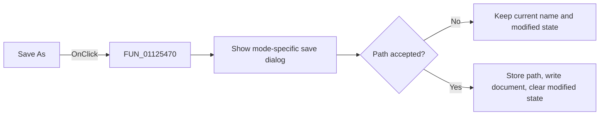

# S&ave As...

> Analysis status: Reviewed against the recovered Save As path.

## Control

| Property | Recovered value |
| --- | --- |
| Form | SignalEditorDlg |
| Component path | SignalEditorDlg.PopupMenu.pmiSaveAs |
| Control class | TMenuItem |
| Caption | S&ave As... |
| Hint | Not present in the recovered resource. |
| Text | Not present in the recovered resource. |
| Handler name | pmiSaveAsClick |
| Handler address | 01125470 |
| Graph node | `resource:dfm:SignalEditorDlg/SignalEditorDlg.PopupMenu.pmiSaveAs` |
| Handler node | `function:01125470` |
| Graph layer | UI |

## What happens when clicked

The click delegates to `FUN_01125df0`. It selects the user-defined save dialog
for mode `8` and the piecewise-linear save dialog otherwise, seeds that dialog
with the current file name, and waits for a result. Cancel leaves the file name,
document, and modified state unchanged. On acceptance, it stores the selected
path, writes the active editor object to that path, and clears the modified state.

## Click flow

## Handler evidence

- Source: [DecompiledSources/Tina16/functions/0000000001125470__FUN_01125470.c](../../../DecompiledSources/Tina16/functions/0000000001125470__FUN_01125470.c)
- Recovered role: Save the active editable signal document under a selected name.
- Current graph summary: Handles 1 Delphi UI event: SignalEditorDlg.PopupMenu.pmiSaveAs.OnClick.
- Current graph behavior: Delegates to the mode-specific save-dialog path.
- Current graph evidence: `FUN_01125470` wraps `FUN_01125df0`; the callee branches on mode `8` and checks each dialog result before writing.
- Complexity: simple
- Distinct outgoing calls: 1

## Direct calls

- `function:01125df0` — FUN_01125df0

## Resource evidence

- Kind: Not present in the recovered resource.
- Modal result: Not present in the recovered resource.
- Checked state: Not present in the recovered resource.
- List items: Not present in the recovered resource.
- Image reference: Not present in the recovered resource.
- Extracted glyph: None.

## Nearby label candidates

Nearby labels are layout candidates only. They are not proof of behavior.

- No same-parent label candidate is available.

## Analysis limits

- The recovered source does not expose the dialog filters or lower-level file-write errors.
- Cancel is a verified no-op for the stored document path.
