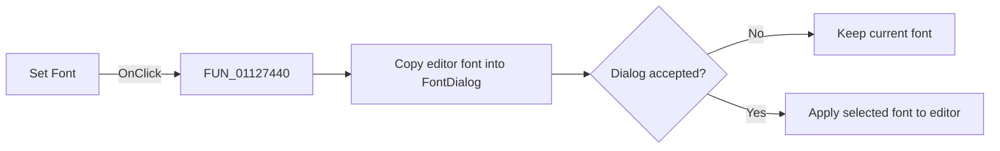

# Set &Font...

> Analysis status: Reviewed against the recovered font-dialog path.

## Control

| Property | Recovered value |
| --- | --- |
| Form | SignalEditorDlg |
| Component path | SignalEditorDlg.PopupMenu.pmiSetFont |
| Control class | TMenuItem |
| Caption | Set &Font... |
| Hint | Not present in the recovered resource. |
| Text | Not present in the recovered resource. |
| Handler name | pmiSetFontClick |
| Handler address | 01127440 |
| Graph node | `resource:dfm:SignalEditorDlg/SignalEditorDlg.PopupMenu.pmiSetFont` |
| Handler node | `function:01127440` |
| Graph layer | UI |

## What happens when clicked

The handler reads the current editor font, copies it into the form's
`TFontDialog`, and shows the dialog. Cancel returns without changing the editor.
If the dialog is accepted, the handler applies the selected font back to the
editor. No file or signal-model state is changed.

## Click flow

## Handler evidence

- Source: [DecompiledSources/Tina16/functions/0000000001127440__FUN_01127440.c](../../../DecompiledSources/Tina16/functions/0000000001127440__FUN_01127440.c)
- Recovered role: Change the user-defined editor font through the VCL font dialog.
- Current graph summary: Handles 1 Delphi UI event: SignalEditorDlg.PopupMenu.pmiSetFont.OnClick.
- Current graph behavior: Seeds, shows, and conditionally applies the form's `TFontDialog`.
- Current graph evidence: The handler reads the editor font, calls the dialog virtual method, and applies the dialog font only when the result is nonzero.
- Complexity: complex
- Distinct outgoing calls: 3

## Direct calls

- `function:00725900` — FUN_00725900
- `function:00bf2c10` — FUN_00bf2c10
- `function:00bfafa0` — FUN_00bfafa0

## Resource evidence

- Kind: Not present in the recovered resource.
- Modal result: Not present in the recovered resource.
- Checked state: Not present in the recovered resource.
- List items: Not present in the recovered resource.
- Image reference: Not present in the recovered resource.
- Extracted glyph: None.

## Nearby label candidates

Nearby labels are layout candidates only. They are not proof of behavior.

- No same-parent label candidate is available.

## Analysis limits

- The exact font properties are managed by VCL objects and are not enumerated in this handler.
- Cancel is a verified no-op.
